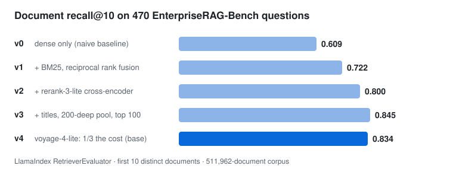

<h1 align="center">enterprise-rag</h1>

<p align="center">
  <b>Question answering over 512K enterprise documents, from Slack, Gmail, Jira, Confluence and five other systems.</b><br>
  Built on LlamaIndex, Qdrant and Voyage AI, and measured on the public
  <a href="https://github.com/onyx-dot-app/EnterpriseRAG-Bench">EnterpriseRAG-Bench</a> leaderboard.
</p>

<p align="center">
  
  
  
  
  
</p>

<p align="center">
  
</p>

## Highlights

- **+37% retrieval recall.** Recall@10 rises from **0.609 to 0.834** on the benchmark's 470
  questions, one measured change per version, with every run reproducible from saved results.
- **Hybrid search with reranking, at a third of the cost.** Dense `voyage-4-lite` and BM25 are
  fused by RRF, and the top 100 chunks are reranked by a Voyage cross-encoder. Switching to the
  lite embedder saved two thirds of the embedding cost (about $12 for the whole corpus) with no
  significant loss: a paired 95% confidence interval shows a −0.011 change, within noise.
- **Answers from whole documents, run locally.** The top 10 documents are read whole by
  `gemma4:26b` on Ollama, at $0 per answer. All 500 benchmark questions are answered, and the
  official LLM-judge score is next.
- **Built like production code.** 107 user stories, each shipped as one small test-first PR, with
  700+ tests. Byte-exact corpus goldens, resumable long runs, Phoenix tracing, and a cost
  estimate before every paid API call.

## Goal

A **top-5** place on the EnterpriseRAG-Bench leaderboard ([PROJECT_GOAL.md](PROJECT_GOAL.md)).
The leaderboard score is the mean over 500 questions of *correct (0/1) × completeness (%)*, judged
by an LLM. For reference, the BM25 + GPT-5.4 baseline scores 50.6, 10th place 65.61 and 1st
place 86.58.

## How it works

```
                     ┌──────────── ingestion (offline) ─────────────┐
 documents.parquet → │ per-source cleaning → titled chunks          │
 511,962 docs        │ SentenceSplitter(512) → voyage-4-lite        │
                     │ + FastEmbed BM25  →  Qdrant (dense + sparse) │
                     └──────────────────────────────────────────────┘
                                         │
 question ─→ QueryFusionRetriever: dense top 200 + BM25 top 200, RRF → top 100 chunks
          ─→ VoyageAIRerank (rerank-3-lite) → chunks re-sorted
          ─→ FullDocuments postprocessor: first 10 distinct documents, read whole
          ─→ RetrieverQueryEngine + answer prompt → gemma4:26b → answer + document ids
```

Every step in the query path is a LlamaIndex component. Custom logic enters only as a subclass
of a LlamaIndex extension point (`BaseNodePostprocessor`, `NodeParser`); see
[`pipeline/eval/answers.py`](pipeline/eval/answers.py). Chunks decide *which* documents are read
and in what order: a document ranks where its best chunk ranks, and the answerer reads the whole
document, as the benchmark's own baseline does.

**Ask page.** [`pipeline/eval/ask_page.py`](pipeline/eval/ask_page.py) is a Gradio app. It
answers any question live, streams the answer, and shows its 10 source documents. For a
benchmark question, it also shows the gold answer and facts next to ours. Every request is traced
in Arize Phoenix.

## Results

| version | what changed (one thing per version) | recall@10 | MRR@10 | nDCG@10 |
|---|---|---|---|---|
| v0 | naive baseline: dense `voyage-4` only, library defaults | 0.609 | 0.493 | 0.494 |
| v1 | + BM25 keyword search, fused with dense by reciprocal rank fusion | 0.722 | 0.622 | 0.619 |
| v2 | + Voyage `rerank-3-lite` cross-encoder over the top 50 | 0.800 | 0.785 | 0.762 |
| v3 | + document titles in the indexed text, a 200-deep fusion pool, the top 100 reranked | **0.845** | 0.818 | 0.799 |
| **v4** | dense vectors on `voyage-4-lite`: a third of the embedding cost, within noise of v3 | 0.834 | 0.809 | 0.790 |

The per-source and per-question-type breakdowns, the confidence intervals, and every
intermediate step are in [docs/eval/results.md](docs/eval/results.md). An interactive version is
[docs/eval/report.html](docs/eval/report.html).

## Quickstart

```sh
uv sync                                        # pinned dependencies (Python 3.14)
uv run python -m unittest discover tests       # full suite; tests that need the corpus skip without data/
```

With the corpus in `data/`
([Hugging Face](https://huggingface.co/datasets/onyx-dot-app/EnterpriseRAG-Bench), MIT), Qdrant
on `:6333`, Ollama with `gemma4:26b`, and `VOYAGE_API_KEY` in `.env`:

```sh
uv run python -m pipeline.eval.ask_page        # ask page on http://localhost:7860
uv run python -m pipeline.eval.answer_run      # answer all 500 benchmark questions (resumable)
```

## How this was built

- **Measured, not guessed.** Every design decision cites a count from the real corpus. For
  example, 4 document ids each name two different documents, and a 1.4 GB single-row-group
  parquet makes every read cost 1.2 s. Each decision is recorded in
  [`docs/decisions/`](docs/decisions/) and [`docs/design/`](docs/design/), with the evidence and
  the options rejected.
- **Story-driven and test-first.** Each of the [107 stories](docs/stories.md) has acceptance
  criteria and a real-data example, and ships as one function in one small PR, red tests first.
  Tests that run on the real corpus pin the measured numbers.
- **Byte-exact goldens.** Each cleaned corpus has a sha256 fingerprint, so a refactor must leave
  every output byte unchanged.
- **Cost discipline.** Question embeddings and reranks are computed once and replayed, so
  re-scoring any version costs $0. Every paid run is estimated before it starts.
- **Resumable long runs.** Embedding 1.6M chunks and answering 500 questions both write each
  result as soon as it is made, so a crash never redoes finished work.
- **Observability.** LlamaIndex instrumentation events go to a JSON-lines run log for each stage,
  and OpenInference traces go to Phoenix.
- **Per-source pipelines.** Slack, Gmail and Confluence each have their own cleaning pipeline:
  unescaping, quote stripping, speaker parsing, and markdown-it heading detection. Confluence
  headings and Slack message starts are checked against hand-labelled truth sets.

## Roadmap

- [x] Retrieval: hybrid search, reranking, titles, lite embedder (v0 → v4)
- [x] Answer generation over whole documents with a local LLM; all 500 questions answered
- [ ] Leaderboard score with the benchmark's official LLM judge
- [ ] Prompt tuning driven by the judge's per-question verdicts
- [ ] Better recall on semantic questions: query rewriting and an agent retrieval loop
- [ ] Top-5 submission

## Repository map

```
pipeline/
  eval/         retrieval, reranking, answer generation, scoring, ask page, reports
  slack/        Slack threads → clean text → one node per thread
  gmail/        Gmail threads → messages, headers, quotes, attachments
  *.py          Confluence: cleaning, heading detection, markdown with stable line ranges
tests/          unittest suite, doctests, corpus goldens, hand-labelled truth sets
docs/
  stories/      every story, with acceptance criteria and measured numbers
  eval/         results table, per-run metrics, interactive report
  design/       one system design per source
  decisions/    one record per decision: why, evidence, rejected options
```

## Stack

Python 3.14 · LlamaIndex · Qdrant · Voyage AI (`voyage-4`, `voyage-4-lite`, `rerank-3-lite`) ·
FastEmbed BM25 · Ollama (`gemma4:26b`) · Gradio · Arize Phoenix / OpenInference · pyarrow · uv
