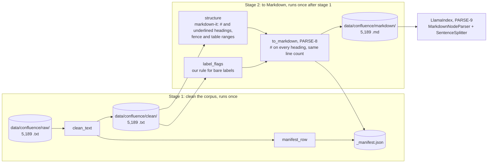

# Confluence Parser: System Design

| | |
|---|---|
| **Status** | Draft, under review |
| **Owner** | Deepak Dantagani |
| **Scope** | Parsing stage of the Enterprise RAG ingestion pipeline: PARSE-1, 2, 4 (clean, manifest, label rule) and PARSE-8 (`to_markdown`, one pass per file that writes the `#`s). Buckets, heading detectors and blocks (PARSE-3, 5, 6, 7) are retired by PARSE-8d. The LlamaIndex chunking (PARSE-9) has its own design: [chunker design](2-chunker-system-design.md). |
| **Source corpus** | EnterpriseRAG-Bench, Confluence subset: 5,189 `.txt` exports (wikis, runbooks, structured documentation) |
| **Related** | [Stories](../stories/1-parsing.md) · [Story rules](../stories.md) · [Decision 0001: parser choice](../decisions/0001-confluence-parser.md) |
| **Last updated** | 2026-09-16 |

---

## 1. Requirement

> Turn 5,189 Confluence page exports into clean text with a reliable section structure
> (headings) and block structure (lists, tables, code), so that every heading can be
> written as `#` and a standard Markdown chunker cuts every page by section, with every
> line of every page accounted for. The result must be deterministic and provable: the
> same input always gives the same output, and a one-number fingerprint proves nothing
> changed after a refactor.

What "reliable structure" means for this corpus: the pages were not written one way.
Only 32% use Markdown headings; 15% underline their headings; 53% write bare labels
such as `Overview:` with no markup at all. A standard Markdown parser sees no headings in
that last group. The parser must recover them.

Out of scope: chunk sizing, embeddings, retrieval, any network or model call. Chunking
itself is library code; see the [chunker design](2-chunker-system-design.md).

## 2. Overview

The parser is a straight pipeline of pure functions with file handling at the edges.
Two stages, one folder in between:

- **Stage 1** reads each raw file once, fixes the export's damage (JSON-escaped bodies, wiki markup, missing table separators), writes the clean file, and records one manifest row per file as the audit trail.
- **Stage 2** is one pass per clean file. `structure` asks markdown-it which lines are `#` or underlined headings and which ranges are fences or tables; `label_flags` applies our rule for bare labels; `to_markdown` judges every line on its own and writes the `#`s, never inside a fence or table, keeping the line count, and the writer saves the Markdown copy with its sha256 in the manifest. There is no file-level style decision, so a page that mixes styles gets all its headings. From there on, chunking is LlamaIndex's own Markdown chunker.

Golden checks lock every stage: a sha256 over the corpus-wide output of each function is stored under `tests/golden/`, so any change in behaviour fails a test.
