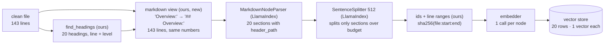

# Confluence Chunker: System Design

| | |
|---|---|
| **Status** | Draft, under review |
| **Owner** | Deepak Dantagani |
| **Scope** | Chunking stage of the Enterprise RAG ingestion pipeline: the Markdown view (PARSE-8) and the LlamaIndex adapter that chunks it (PARSE-9). Embedding, vector storage and retrieval are out of scope; their numbers appear here only where they constrain chunking. |
| **Inputs** | Per clean file: `detector_for(text).find_headings(lines)` (where sections start, all three heading styles) and `blocks(text)` (which lines are tables and code, so no heading is written inside one). See the [parser design](1-parser-system-design.md). |
| **Related** | [Stories](../stories/2-chunking.md) · [Story rules](../stories.md) · [Parser design](1-parser-system-design.md) |
| **Last updated** | 2026-09-16 |
| **Decision** | 2026-09-16: no custom chunker. Our code writes `#` on the headings it finds; LlamaIndex's `MarkdownNodeParser` and `SentenceSplitter` do the chunking. Section 6 has the pipeline, section 7 the evidence. |

---

## 1. Requirement

> Cut each of the 5,189 clean Confluence pages into chunks that are the retrieval unit
> for EnterpriseRAG-Bench: each chunk sits inside one section, fits the embedder's
> budget, and carries its breadcrumb and exact line range so an answer can cite it.
> Every non-blank line lands in exactly one chunk. Same input, same chunks, same ids,
> every run. Use library code for everything a library already does.

Why this shape: one embedding call returns **one vector per chunk**, not one per token.
A chunk that mixes five topics gets one blurred vector and matches a question about any
one of them weakly. A chunk about one section matches strongly. So the chunk must be one
topic, and the section is the author's own topic boundary.

Out of scope: embedding model choice beyond its token limit, vector store, retrieval,
answer generation, any network or model call inside the chunker.


**One page through the pipeline** (the scheduler page, 143 lines, 20 headings):



Ours: cleaning, heading detection, the `#` rewrite, ids. Library: the cutting. One chunk
becomes one vector; inside the embedder every token gets a vector for a moment, then
they are pooled into one, and only that one is stored. That is why a chunk should hold
one topic, and the author's section is the topic boundary.

## 2. The data

Measured on the 5,189 clean files (`data/confluence/clean/`), 51 MB of text, about
12.7M tokens at 4 chars per token.

**Pages**

| | p50 | p95 | max |
|---|---|---|---|
| chars per page | 9,607 | 14,339 | 24,881 |
| lines per page | 156 | 302 | 648 |
| headings per page | 21 | 38 | 75 |

Only 28 pages fit in one chunk. Every page gets split.

**Sections** (text between two honoured headings; 91,385 with a body, 11,343 heading-only)

| | p10 | p50 | p95 | p99 | max |
|---|---|---|---|---|---|
| chars per section | 172 | 368 | 1,121 | 4,290 | 12,531 |

- 98.1% of sections fit in 2,048 chars. One section, one chunk, is the common case.
- 1,698 sections exceed 2,048 chars and need 2 to 7 pieces.
- 56% of sections are under 400 chars. Read in samples, each is a complete fact once its
  heading is attached ("Required alerts → must be routed to the owning on-call"). Small
  is not noise.

**Blocks** (281k; text 119k, list 111k, heading 40k, rule 5k, table 3.7k, code 2k)

- Median block 73 chars, p99 1,017.
- 271 single blocks exceed 2,048 chars: 221 lists, 34 tables, 9 paragraphs, 7 code
  fences. The lists are runbooks written as one numbered list where every number is a
  step with nested bullets. The parser is right that it is one list; the retrieval unit
  is the step.

**Structure**: 32% `#` headings, 15% underlined, 53% bare labels, 12 pages pure prose.
254 pages have 0 or 1 heading; for those the page is one section and step 5 windows it.

## 3. Scope decisions

| Question | Decision | Why |
|---|---|---|
| Batch only, or pages change later? | Design for change now | The goal deploys on AWS; one page edit must re-embed ~20 vectors, not 95,000. Cost of deciding now: one id function. |
| Chunk id | `sha256(file sha256 + ":" + start + ":" + end)` | Same bytes and same range give the same id on every run. LlamaIndex's default is `uuid4()`; PARSE-9 passes this as `id_func`. |
| Metadata on every chunk | `doc_id`, `title`, `heading_path`, `start_line`, `end_line`, `sha256` | Enough to cite the exact lines of the exact version, and to walk up to the parent section. Nothing else exists in the raw export today. |
| Node relationships | `SOURCE`, `PREVIOUS`, `NEXT` set by LlamaIndex automatically; `PARENT` / `CHILD` by a later parent-child story from `header_path` | Relationships are ids in metadata. They are used after vector search (auto-merge, neighbours, citation), never fed to the embedder. The vector sees only `heading_path` + text. |
| Embedder | Hosted (OpenAI or Voyage); pick by MTEB at the time | Cheapest to iterate. All candidates accept ≥ 8k tokens, so the chunk size is a quality choice, not a limit. |

## 4. Back-of-envelope

| Quantity | Estimate | How |
|---|---|---|
| chunks | ≈ 95,000 (18 per page) | 89,687 sections ≤ 2,048 chars → 1 node each; 1,698 big ones → about 5,400 windows. v0 produced 96,360, same ballpark. |
| tokens to embed | ≈ 14M | 12.7M text + ~15 tokens of breadcrumb × 95k chunks |
| average chunk | ≈ 150 tokens (median ≈ 90) | well under the 512 budget; the cap bites only on the tail |
| one full embed | ≈ $1.80 (OpenAI 3-large), $0.85 (Voyage 3.5), $0.30 (OpenAI 3-small) | list prices, verify before committing |
| vector storage | 1.2 GB at 3,072 dims float32; 0.4 GB at 1,024 dims | 95k × dims × 4 bytes |
| with HNSW index | ≈ 3 GB worst case | fits in memory on a small instance; no quantization needed |
| context per question | k × 512 tokens; k = 10 → ≤ 5k tokens | the one query-time number chunking owns |

Conclusion: neither cost nor storage constrains the design. Re-chunking and re-embedding
the whole corpus is a casual operation, so chunk-size experiments are cheap.

**Beyond Confluence.** Confluence is 3.6% of EnterpriseRAG-Bench (51 MB of 1.41 GB;
5,189 of ~512,000 documents, most of them Slack and Gmail). Scaled to the whole benchmark,
3,072-dim float32 vectors plus an HNSW index come to roughly 50 GB in memory; 1,024 dims
at float16 is about 8 GB. Fine for Confluence alone, expensive for the full corpus. So
dimensions and precision are decided once, for all nine sources, when the embedder is
chosen. That decision does not touch the chunker.

## 5. SLOs and error budgets

| SLO | Target | Budget | Checked by |
|---|---|---|---|
| Coverage: every non-blank line of the markdown view is inside exactly one node | 100% | zero; one lost line fails the build | test over all 5,189 files |
| Line count: markdown view has exactly the clean file's line count | 100% | zero | manifest check per file |
| Size: node ≤ 512 tokens (embedder's tokenizer) | 100% | zero; `SentenceSplitter` guarantees it | test over all files |
| Determinism: same input, same nodes, same ids | 100% | zero | `tests/golden/nodes_fingerprint.json` (id, start, end, path per node) |
| Throughput: full corpus, one process, laptop | < 60 s | soft, warning only | timed test |

## 6. The pipeline

Six steps. Four exist or are library code; two are new and small.

| # | Step | Owner | Size | What it does |
|---|---|---|---|---|
| 1 | `clean_text` | ours, exists | PARSE-1 | raw export → clean text. Unescape, whitespace, structure fixes. Line count from here on is the citation line count. |
| 2 | `find_headings` | ours, exists | PARSE-5/6 | `#`, underlined, and bare-label headings → `(line, level, text)`. The label rule is the part no library has (section 7). |
| 3 | `markdown_view` | **ours, new** | ~20 lines, PARSE-8 | write `#`×level in front of each heading line; blank a setext underline; never touch a line inside a `table` or `code` block (markdown-it says which). Same line count in and out. Written to `data/confluence/markdown/` and fingerprinted in the manifest. |
| 4 | `MarkdownNodeParser` | LlamaIndex | 0 | cut at every `#` line → one node per section, `header_path` metadata, `#` inside ``` fences ignored. A page with no headings comes out as one node. |
| 5 | `SentenceSplitter(chunk_size=512)` | LlamaIndex | 0 | leaves the 98% of sections that fit untouched; windows the rest with overlap 0. Pages where step 2 found no headings (~254, 5%) skip step 4 and are windowed with overlap 64 (12%), because blind windows lose boundary sentences and section cuts do not. Two `IngestionPipeline`s, one `if`. |
| 6 | ids, line ranges, metadata | **ours, new** | ~15 lines, PARSE-9 | `id_func = sha256(file sha256:start:end)`; `start_line` from the node text's position in the view; drop nodes that are only a heading line; `title` + `heading_path` in the embed text, nothing else. |

**Worked example**, first lines of the scheduler page:

```
clean (step 1)            markdown view (step 3)        nodes (steps 4-6)
 0 Scheduler Health…       0 # Scheduler Health…         node 1  lines 2-5   path /Scheduler…/   "## Overview:\n\nThis playbook…"
 2 Overview:               2 ## Overview:                node 2  lines 6-10  path /Scheduler…/   "## Audience:\n- Oncall SREs…"
 4 This playbook…          4 This playbook…              node 3  lines 11-15 …
 6 Audience:               6 ## Audience:
 7 - Oncall SREs…          7 - Oncall SREs…
```

Line numbers are identical in all three columns, so a citation is the same lines in
raw, clean and markdown. Measured on three pages of each style (section 7): 20/20,
20/20, 20/20 sections, line ranges recovered for every node.

**Budget** is 512 tokens, counted by `SentenceSplitter` with the tokenizer it is given;
PARSE-9 passes the embedder's. Until then the default tokenizer stands in.

**What the library does not do, and we accept:**
- Inside the 2% of sections over budget, `SentenceSplitter` cuts at sentences, not at
  list items or table rows. A runbook step can be split from its bullets there. PARSE-16
  measures whether that costs recall; if it does, a list-aware splitter is one story.
- The heading line stays inside the node text (`## Overview:` is line 1 of node 1). The
  breadcrumb therefore appears once in the body and once in the prefix at embed time.
  Harmless for retrieval; the citation renderer strips the leading `#`s.
- Parent-child ("small to big") is not built in for Markdown. `header_path` names the
  parent, so a parent node per section is a later story on top, not a chunker change.

## 7. Rejected on evidence

**A custom chunker.** Eight pure functions, about 150 lines: content blocks, packing,
a lead-in rule, list and table splitting, parent lines. Prototyped and rejected on
2026-09-16 because, once headings are written as `#`, LlamaIndex's `MarkdownNodeParser`
produces the same sections:

| page | style | custom chunker | `MarkdownNodeParser` after the `#` rewrite |
|---|---|---|---|
| scheduler | bare labels | 19 chunks | 20 sections, 20/20 line ranges |
| privilege manual | bare labels | 19 chunks | 20 sections, 20/20 line ranges |
| autotune playbook | underlined | 20 | 20 sections |
| ADR sample | underlined | 6 | 6 sections |
| onboarding PRD | `#` | 30 | 28 sections |

The 150 lines bought list-aware cuts on 2% of sections and one field for parent-child.
Not worth a second chunker to maintain.

**Off-the-shelf heading detection instead of our label rule.** `unstructured`'s
`partition_text` is the strongest plain-text title heuristic available. On the same
pages:

| page | true headings | `unstructured` titles | ours |
|---|---|---|---|
| scheduler | 18 | 7, of which 4 are `curl` lines | 20, 2 false |
| runbook guidelines | 21 | 0 | 3 today, 21 after PARSE-15 |
| privilege manual | 21 | 1 | 20 |

`MarkdownNodeParser` alone gives 1 node per page on the 68% of files without `#`. So
the label rule is the one piece of the pipeline no library replaces; it stays, and
everything downstream of it is library code.

**Merge tiny sections by size.** 56% of sections are under 400 chars, but samples read
as complete facts with the breadcrumb. Rejected; the breadcrumb does the job.

**Merge a section ending with `:` into the next.** 133 cases (0.15%). Most are a real
parent followed by a real child; the rest are false headings. Rejected.

**Parser defects found by chunk dry runs** (logged for the parser stories; every one of
them is also a row in the PARSE-14 audit, re-run after every parser change):

Policy for heading misses: a missed heading never loses text, it only mislabels a chunk
(coverage SLO), so misses are tolerated and measured, not chased one by one. The label
rule is tuned against a hand-labelled sample (the 13 fixtures plus 50 random pages),
each fix must move the sample's heading recall, and PARSE-16 measures what mislabels
actually cost.

| Defect | Evidence | Where it is fixed |
|---|---|---|
| One stray `#` line flips a label file to bucket A, so the label rule never runs | "Runbook authoring and maintenance guidelines": one `## - 2026-01-12` line inside a template; 3 headings found instead of 21. Corpus: 256 of 1,645 bucket-A files have ≤ 2 `#` lines and ≥ 5 `Label:` lines, about 5% | PARSE-15: bucket by the dominant signal |
| A label with the colon in the middle is not a heading to the label rule | "Privilege Approval Safeguards": `Operational Runbook: Approving a Level 3 Grant (step-by-step)` missed; its 6 steps land in the previous section | PARSE-12 label-rule tuning |
| Unfenced code, YAML and pipe-less table rows promoted to headings | `route_slo = sum_i(…)`, `job_name: …`, `Parameter \| Description \| Default`; about 50 cases | PARSE-12 label-rule tuning |

## 8. How we validate the bet

The design bets that a small chunk (median ≈ 90 tokens) with its heading path retrieves
better than a larger one. Evidence for: Chroma's chunking study, where 200-token chunks
with no overlap beat 400 and 800 (88.1% recall, 7.0% precision, OpenAI 3-large), and the
rule that the unit should be the smallest text that answers a question on its own, which
for a wiki is the section. Evidence against: analytical questions want 1k+ tokens of
context. Parent-child (variant B below) is the hedge for those.

Nobody can settle it without questions. EnterpriseRAG-Bench ships 500 questions with
ground-truth documents. After PARSE-9, one story runs the same questions against three
indexes, same embedder, and reports recall@20 (a chunk from the ground-truth page is in
the top 20), per question category:

| variant | median chunk |
|---|---|
| A: this design, `markdown_view` → `MarkdownNodeParser` → `SentenceSplitter` | ≈ 90 tokens |
| B: A plus parent-child (parent node per section from `header_path`, `AutoMergingRetriever`) | small match, parent returned |
| C: `SentenceSplitter` alone on the clean text, no headings, the baseline | ≈ 512 tokens |

Three embeds cost under $6. The winner becomes the default. Contextual retrieval (an
LLM-written prefix per chunk) is a later experiment on top of the winner, not a chunker
change.

Sources: [Chroma, Evaluating Chunking Strategies](https://www.trychroma.com/research/evaluating-chunking) ·
[NVIDIA, Finding the Best Chunking Strategy](https://developer.nvidia.com/blog/finding-the-best-chunking-strategy-for-accurate-ai-responses.md/) ·
[Anthropic, Contextual Retrieval](https://www.anthropic.com/engineering/contextual-retrieval) ·
[EnterpriseRAG-Bench](https://github.com/onyx-dot-app/EnterpriseRAG-Bench)
