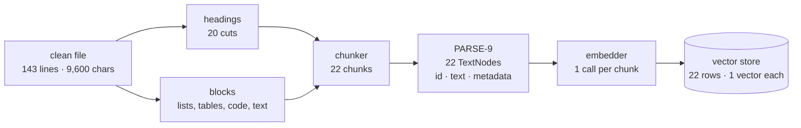
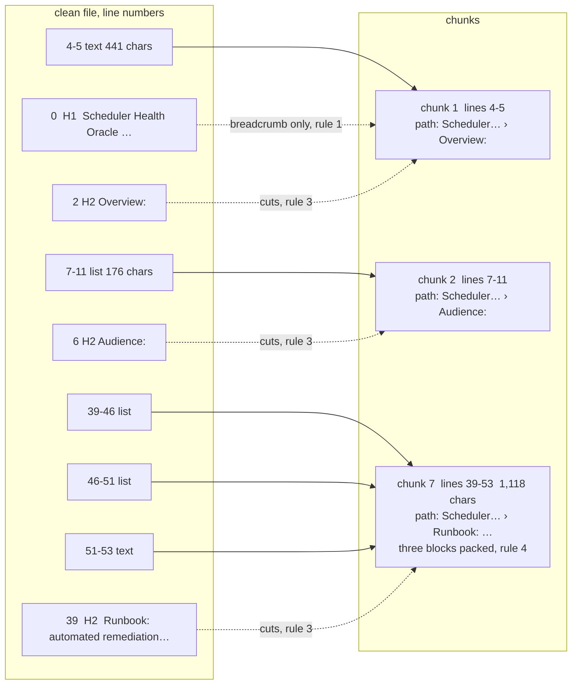

# Confluence Chunker: System Design

| | |
|---|---|
| **Status** | Draft, under review |
| **Owner** | Deepak Dantagani |
| **Scope** | Chunking stage of the Enterprise RAG ingestion pipeline: PARSE-8 (chunker) and the id rule PARSE-9 must follow. Embedding, vector storage and retrieval are out of scope; their numbers appear here only where they constrain the chunker. |
| **Inputs** | Per clean file: `blocks(text)` (line ranges that must stay whole) and `detector_for(text).find_headings(lines)` (where sections start). See the [parser design](1-parser-system-design.md). |
| **Related** | [Stories](../stories/2-chunking.md) · [Story rules](../stories.md) · [Parser design](1-parser-system-design.md) |
| **Last updated** | 2026-09-15 |

---

## 1. Requirement

> Cut each of the 5,189 clean Confluence pages into chunks that are the retrieval unit
> for EnterpriseRAG-Bench: each chunk sits inside one section, never cuts a list, table
> or code block, fits the embedder's budget, and carries its breadcrumb and exact line
> range so an answer can cite it. Every non-blank line lands in exactly one chunk.
> Same input, same chunks, same ids, every run.

Why this shape: one embedding call returns **one vector per chunk**, not one per token.
A chunk that mixes five topics gets one blurred vector and matches a question about any
one of them weakly. A chunk about one section matches strongly. So the chunk must be one
topic, and the section is the author's own topic boundary.

Out of scope: embedding model choice beyond its token limit, vector store, retrieval,
answer generation, any network or model call inside the chunker.


**One page through the pipeline** (the scheduler page, 143 lines, 20 headings):



One chunk becomes one vector. Inside the embedder every token gets its own vector for a
moment, then they are pooled into one; only the pooled vector is stored. That is why a
chunk should hold one topic.

## 2. The data

Measured on the 5,189 clean files (`data/confluence/clean/`), 51 MB of text, about
12.7M tokens at 4 chars per token.

**Pages**

| | p50 | p95 | max |
|---|---|---|---|
| chars per page | 9,607 | 14,339 | 24,881 |
| lines per page | 156 | 302 | 648 |
| headings per page | 21 | 38 | 75 |

Only 28 pages fit in one chunk. Every page gets split.

**Sections** (text between two honoured headings; 91,385 with a body, 11,343 heading-only)

| | p10 | p50 | p95 | p99 | max |
|---|---|---|---|---|---|
| chars per section | 172 | 368 | 1,121 | 4,290 | 12,531 |

- 98.1% of sections fit in 2,048 chars. One section, one chunk, is the common case.
- 1,698 sections exceed 2,048 chars and need 2 to 7 pieces.
- 56% of sections are under 400 chars. Read in samples, each is a complete fact once its
  heading is attached ("Required alerts → must be routed to the owning on-call"). Small
  is not noise.

**Blocks** (281k; text 119k, list 111k, heading 40k, rule 5k, table 3.7k, code 2k)

- Median block 73 chars, p99 1,017.
- 271 single blocks exceed 2,048 chars: 221 lists, 34 tables, 9 paragraphs, 7 code
  fences. The lists are runbooks written as one numbered list where every number is a
  step with nested bullets. The parser is right that it is one list; the retrieval unit
  is the step.

**Structure**: 32% `#` headings, 15% underlined, 53% bare labels, 12 pages pure prose.
254 pages have 0 or 1 heading; for those the page is one section and rule 4 packs it.

## 3. Scope decisions

| Question | Decision | Why |
|---|---|---|
| Batch only, or pages change later? | Design for change now | The goal deploys on AWS; one page edit must re-embed ~20 vectors, not 95,000. Cost of deciding now: one id function. |
| Chunk id | `sha256(file sha256 + ":" + start + ":" + end)` | Same bytes and same range give the same id on every run. LlamaIndex's default is `uuid4()`; PARSE-9 passes this as `id_func`. |
| Metadata on every chunk | `doc_id`, `title`, `heading_path`, `start_line`, `end_line`, `sha256`, `parent_id` | Enough to cite the exact lines of the exact version, and to walk up to the parent section. Nothing else exists in the raw export today. |
| Node relationships | `SOURCE`, `PREVIOUS`, `NEXT` set by LlamaIndex automatically; `PARENT` / `CHILD` set by PARSE-9 from `parent_id` | Relationships are ids in metadata. They are used after vector search (auto-merge, neighbours, citation), never fed to the embedder. The vector sees only `heading_path` + text. |
| Embedder | Hosted (OpenAI or Voyage); pick by MTEB at the time | Cheapest to iterate. All candidates accept ≥ 8k tokens, so the chunk size is a quality choice, not a limit. |

## 4. Back-of-envelope

| Quantity | Estimate | How |
|---|---|---|
| chunks | ≈ 95,000 (18 per page) | 89,687 sections ≤ 2,048 chars → 1 each; 1,698 big ones → 5,384 pieces. v0 produced 96,360, same ballpark. |
| tokens to embed | ≈ 14M | 12.7M text + ~15 tokens of breadcrumb × 95k chunks |
| average chunk | ≈ 150 tokens (median ≈ 90) | well under the 512 budget; the cap bites only on the tail |
| one full embed | ≈ $1.80 (OpenAI 3-large), $0.85 (Voyage 3.5), $0.30 (OpenAI 3-small) | list prices, verify before committing |
| vector storage | 1.2 GB at 3,072 dims float32; 0.4 GB at 1,024 dims | 95k × dims × 4 bytes |
| with HNSW index | ≈ 3 GB worst case | fits in memory on a small instance; no quantization needed |
| context per question | k × 512 tokens; k = 10 → ≤ 5k tokens | the one query-time number chunking owns |

Conclusion: neither cost nor storage constrains the design. Re-chunking and re-embedding
the whole corpus is a casual operation, so chunk-size experiments are cheap.

**Beyond Confluence.** Confluence is 3.6% of EnterpriseRAG-Bench (51 MB of 1.41 GB;
5,189 of ~512,000 documents, most of them Slack and Gmail). Scaled to the whole benchmark,
3,072-dim float32 vectors plus an HNSW index come to roughly 50 GB in memory; 1,024 dims
at float16 is about 8 GB. Fine for Confluence alone, expensive for the full corpus. So
dimensions and precision are decided once, for all nine sources, when the embedder is
chosen. That decision does not touch the chunker.

## 5. SLOs and error budgets

| SLO | Target | Budget | Checked by |
|---|---|---|---|
| Coverage: every non-blank line is an honoured heading or inside exactly one chunk | 100% | zero; one lost line fails the build | test over all 5,189 files |
| Size: chunk ≤ 512 tokens (embedder's tokenizer) | 99% of chunks | 1%, ≈ 950 chunks; today's tail is 16 (7 code, 9 paragraphs) | test over all files |
| Determinism: same input, same chunks, same ids | 100% | zero | `tests/golden/chunks_fingerprint.json` |
| Throughput: full corpus, one process, laptop | < 60 s | soft, warning only | timed test |

## 6. Chunking rules


**Worked example**, the first lines of the scheduler page. Left: the file with its
headings (H) and blocks. Right: what the rules make of it.



Heading lines never appear in a chunk's lines; they appear in every chunk's
`heading_path`. Chunk 7 shows packing: three blocks under one heading, 1,118 chars,
fits the budget, so one chunk.

In the order the code applies them. Rules 1 to 5 are unchanged from the PARSE-8
background in the stories; 6 and 7 come from this design. Rule 7 is where the small-chunk
bet is hedged: chunks stay small for precise matching, and `parent_id` lets retrieval
return the larger parent when a question needs context (see section 9).

1. **Heading lines are not content.** A `heading` block is dropped; a `text` or `list`
   block whose first lines are headings loses those lines.
2. **The block wins inside tables, code, quotes.** A heading line inside a `table`,
   `code`, `quote`, `rule` or `html` block, or after content inside any block, stays
   content and does not cut.
3. **A heading cuts.** No chunk spans an honoured heading. Sections are never merged.
4. **Pack, never split.** Blocks in one section are packed greedily until the next block
   would exceed the budget.
   - **4b. A lead-in sticks to what follows.** A one-line block immediately followed by a
     list is never the last block of a chunk; it moves to the next chunk with its list.
     Found by dry run on the onboarding PRD: `8) Pin a model version` (a one-item
     numbered list to markdown-it) landed at the end of chunk 1 and its unindented
     `-` bullets at the start of chunk 2. Most runbooks in the corpus are written this
     way, `N) title` then bullets at column 0, so the packer must treat the pair as one.
5. **Breadcrumb from levels.** `heading_path` is the stack of heading texts above the
   chunk; level 1 is the title.
6. **Oversized blocks split by shape, not by count.**
   - `list` bigger than the budget: split at top-level item boundaries only, so nested
     bullets stay with their step. Each piece keeps the same `heading_path`.
   - `table`: split at row boundaries; every piece repeats the header row and separator.
   - `code`, `text`, `quote`: never split. They are the size-SLO tail.

   How rule 6 cuts a runbook list that is 2,618 chars, one `list` block of 36 lines:

   ```mermaid
   flowchart TB
       subgraph before [one list block, 2,618 chars, over budget]
           direction TB
           A1["1. Detection and triage<br/>  - Confirm scope…<br/>  - Tag incident…"]
           A2["2. Immediate containment<br/>  - Roll forward…<br/>  - Isolate…"]
           A3["3. Controlled healing<br/>  - Step A…<br/>  - Step B…"]
       end
       subgraph after [three chunks, same heading_path]
           direction TB
           B1["chunk a: item 1 with its bullets"]
           B2["chunk b: item 2 with its bullets"]
           B3["chunk c: item 3 with its bullets"]
       end
       A1 --> B1
       A2 --> B2
       A3 --> B3
   ```

   The cut is only ever between `1.`, `2.`, `3.`; a nested bullet never leaves its step.
   A table splits the same way at rows, and each piece starts with the header row again.
7. **Never merge at chunk time; carry `parent_id` instead.** Every chunk records the id
   of its parent **section**: `sha256(file sha256 : parent heading line)`, whether or not
   that section has a body of its own; the title section is the root. PARSE-9 creates one
   parent node per section that has children, held in the docstore only, never embedded,
   with text = its own body plus its children in order. Merging, when a question needs
   the whole parent, happens at retrieval time (parent-child, "small to big": match on
   the small chunk, return the parent). Measured alternative, merging
   subtrees that fit at chunk time: 91,385 → 83,618 chunks, 10,124 children absorbed
   into 2,357 parents. Rejected because it fixes the choice forever; a question aimed
   at one child then always gets its siblings too.

   ```mermaid
   flowchart LR
       subgraph store [stored, always small]
           P["Preconditions<br/>no body → parent node only,<br/>docstore, not embedded"]
           A["A. Confirm baseline<br/>parent_id: P"]
           B["B. Reduce variance<br/>parent_id: P"]
           C["C. Warmup standard<br/>parent_id: P"]
           R["Run labeling<br/>body chunk"]
           R1["Run ID format<br/>parent_id: R"]
           R2["Required tags<br/>parent_id: R"]
       end
       subgraph q1 [narrow question: 'how long is warmup?']
           C1["return C"]
       end
       subgraph q2 [broad question: 'what do I set up before a baseline run?']
           M["A, B, C all hit<br/>→ return P, the whole section"]
       end
       C --> C1
       A --> M
       B --> M
       C --> M
   ```

   The chunker's whole cost for this is one field. The retriever (LlamaIndex
   `AutoMergingRetriever`) does the swap.

**Budget** is `max_tokens = 512`, counted with the chosen embedder's tokenizer. Until
PARSE-9 wires a tokenizer, the chunker measures `len(line) + 1` per line against
`max_chars = 2048` (4 chars per token); the parameter name and the test change together.

## 7. Rejected on evidence

| Idea | Dry run | Verdict |
|---|---|---|
| Merge tiny sections into a neighbour by size | 56% of sections are < 400 chars, yet samples read as complete facts with the breadcrumb | rejected; breadcrumb does the job |
| Merge a section whose body ends with `:` into the next | 133 cases (0.15%). Most are a real parent followed by a real child ("…are true:" → "A) Inventory completeness"); the rest are unfenced code / YAML / pipe-less table rows the label rule promoted to headings | rejected; children stay chunks, false headings are a label-rule issue (about 50 cases, logged for PARSE-12) |
| Keep every oversized block whole | 221 of 271 are runbook lists where each numbered step is the real unit | rejected for lists and tables; kept for code and paragraphs |

**Parser defects found by chunk dry runs** (not chunker rules; logged for the parser stories):

Every assumption in this document has, or gets, a row in the corpus audit (PARSE-14):
one pure function per assumption that counts failures and names examples, re-run after
every parser change. Single-page dry runs find bugs by luck; the audit finds them by count.

Policy for heading misses: a missed heading never loses text, it only mislabels a chunk
(coverage SLO), so misses are tolerated and measured, not chased one by one. The label
rule is tuned against a hand-labelled sample (the 13 fixtures plus 50 random pages),
each fix must move the sample's heading recall, and the retrieval experiment in section
9 measures what mislabels actually cost.

| Defect | Evidence | Where it is fixed |
|---|---|---|
| One stray `#` line flips a label file to bucket A, so the label rule never runs and every `Label:` heading is missed | "Runbook authoring and maintenance guidelines": one `## - 2026-01-12` line inside a template; 3 walls found instead of 21, the top 1,500 chars become one chunk, the last three chunks are filed under "- 2026-01-12: Minor wording updates". Corpus: 256 of 1,645 bucket-A files have ≤ 2 `#` lines and ≥ 5 `Label:` lines, about 5% of the corpus | PARSE-3 / PARSE-6: bucket by the dominant signal (count `#` headings against label lines), and treat a `#` inside a code or template region as content |
| A label with the colon in the middle is not a heading to the label rule | "Privilege Approval Safeguards": `Operational Runbook: Approving a Level 3 Grant (step-by-step)` is missed, so its 6 steps pack into the previous section's chunk, labelled "Exception and Risk Handling". Nothing lost, wrong label | PARSE-12 label-rule tuning |
| Unfenced code, YAML and pipe-less table rows promoted to headings by the label rule | `route_slo = sum_i(…)`, `job_name: quant-family-synthesis`, `Parameter \| Description \| Default`; about 50 cases | PARSE-12 label-rule tuning |

## 8. What changes in the stories

| Stories say (PARSE-8) | This design |
|---|---|
| `max_chars = 1600` | `max_chars = 2048` now, `max_tokens = 512` once PARSE-9 has a tokenizer |
| a block bigger than the budget becomes one chunk | rule 6: lists split at top-level items, tables at rows with header repeated |
| no merge option, no parent link | rule 7: `parent_id` on every chunk; PARSE-9 sets `PARENT`/`CHILD` relationships |
| ids not specified | PARSE-9 passes `id_func = sha256(file sha256:start:end)` |

New sub-stories needed: split of oversized lists, split of oversized tables, `parent_id`,
and rule 4b (lead-in sticks) inside `pack`.
PARSE-8e's golden is generated after those merge.

## 9. How we validate the bet

The design bets that a small chunk (median ≈ 90 tokens) with its heading path retrieves
better than a larger one. Evidence for: Chroma's chunking study, where 200-token chunks
with no overlap beat 400 and 800 (88.1% recall, 7.0% precision, OpenAI 3-large), and the
rule that the unit should be the smallest text that answers a question on its own, which
for a wiki is the section. Evidence against: analytical questions want 1k+ tokens of
context. `parent_id` is the hedge for those.

Nobody can settle it without questions. EnterpriseRAG-Bench ships 500 questions with
ground-truth documents. After PARSE-9, one story runs the same questions against three
indexes, same embedder, and reports recall@20 (a chunk from the ground-truth page is in
the top 20), per question category:

| variant | median chunk |
|---|---|
| this design, small, no merge | ≈ 90 tokens |
| this design + auto-merge to parent at retrieval | small match, parent returned |
| fixed 512-token windows (`SentenceSplitter`), the baseline | ≈ 512 tokens |

Three embeds cost under $6. The winner becomes the default. Contextual retrieval (an
LLM-written prefix per chunk) is a later experiment on top of the winner, not a chunker
change.

Sources: [Chroma, Evaluating Chunking Strategies](https://www.trychroma.com/research/evaluating-chunking) ·
[NVIDIA, Finding the Best Chunking Strategy](https://developer.nvidia.com/blog/finding-the-best-chunking-strategy-for-accurate-ai-responses.md/) ·
[Anthropic, Contextual Retrieval](https://www.anthropic.com/engineering/contextual-retrieval) ·
[EnterpriseRAG-Bench](https://github.com/onyx-dot-app/EnterpriseRAG-Bench)
