# Gmail Ingestion: System Design

| | |
|---|---|
| **Status** | Draft, under review |
| **Owner** | Deepak Dantagani |
| **Scope** | The Gmail source of the Enterprise RAG ingestion pipeline: raw thread exports → clean text → messages → chunks → vectors, plus the retrieval contract that turns chunk hits back into the thread ids the benchmark scores. Function signatures, dataclasses and stories are the low-level design, written after this document is agreed. |
| **Source corpus** | EnterpriseRAG-Bench v1.0.0, Gmail subset: 121,390 thread exports, 1.0 GB, 578,254 messages. `data/gmail/` (archives, raw, profile.json, manifest.json) |
| **Related** | [Gmail stories (low-level design)](../stories/5-gmail.md) · [Parser design](1-parser-system-design.md) · [Chunker design](2-chunker-system-design.md) · [Story rules](../stories.md) |
| **Last updated** | 2026-09-23 |
| **Decision** | 2026-09-23: the **message** is the indexing unit; the **thread** is the scoring and context-assembly unit. Section 3 has the decision, section 7 the evidence for what was rejected. Library-first, as with the chunker: section 6.1 lists the six functions that are actually ours. |

---

## 1. Requirement

> Turn 121,390 Gmail thread exports into retrievable evidence for EnterpriseRAG-Bench.
> Each of the 578,254 messages becomes its own embedded unit carrying its thread's
> context, so a question about one reply matches that reply and not the whole
> conversation. Every chunk carries the thread's `dsid`, because the benchmark scores
> whole threads. Same input, same chunks, same ids, every run.

Why this shape. A thread is a conversation between a median of 6 people over a median of
5 messages, and the messages disagree with each other: one proposes two invoicing
options, the next raises a tax objection, the last records the decision. Embedding the
thread produces one vector for five positions, which matches any question about any of
them weakly. Embedding each message produces a vector per position.

But the benchmark does not ask for messages. Its `expected_doc_ids` are thread `dsid`s —
there is no message-level identifier anywhere in the questions. So the index is
message-grained and the answer is thread-grained, and the join between them is the
`dsid` carried on every chunk.

Out of scope: access control, incremental sync, attachment extraction, HTML parsing,
answer generation. Section 3 says why each is out.

## 2. The data

Measured over all 121,390 raw files after unescaping; written by the profiler to
`data/gmail/profile.json`.

**Threads**

| | p50 | p95 | max |
|---|---:|---:|---:|
| chars per thread | 6,956 | 9,284 | 17,253 |
| messages per thread | 5 | 6 | 12 |
| distinct participants per thread | 6 | 9 | 21 |
| attachment lines per thread | 2 | 4 | 10 |

**Messages** (578,254; body only, headers and quoted history removed)

| | p50 | p90 | p95 | p99 | max |
|---|---:|---:|---:|---:|---:|
| chars per message body | 1,018 | 1,764 | 2,078 | 2,781 | 6,282 |

- **94.7% of message bodies fit in 2,048 chars** (≈ 512 tokens). One message, one chunk,
  is the common case.
- 30,888 messages exceed 2,048 chars and need 2 pieces; only 288 exceed 4,096.

This is the opposite of Confluence, where every one of the 5,189 pages had to be split.
Here splitting is the exception, and the unit the author wrote — one message — is already
the right size.

**Structure.** There is none to recover. 92 threads of 121,390 contain a Markdown
heading. The only structural signal is the message boundary: `From:` at line start.

```
<thread title>                       ← line 1, always, 20,000/20,000 sampled
                                     ← blank
From: Amal Khan <amal.khan@...>      ← message boundary
To: Vivek Kulkarni <vivek@...>
Cc: procure@greenlinehealth.com      ← absent in 19% of blocks
Date: Thu, 25 Jun 2026 09:12:00 -0700
Subject: Invoice & VAT approach for multi-entity pilot (Greenline)

Hi Vivek,
...
Attachment: Greenline_PO_3042.pdf (application/pdf)
```

Header order is `From → To → [Cc] → Date → Subject` in 99.6% of blocks.

**What varies, and how much**

| Variation | Scale | Consequence |
|---|---:|---|
| Literal `\n` instead of line breaks | 28,049 threads (23%) | whole messages collapse to one physical line; `To:`/`Date:`/`Subject:` become invisible to any line-anchored rule. **Must be repaired before splitting.** |
| Two date families | RFC-2822 427,245 · ISO-8601 148,481 | both normalise to one instant, or time filtering is impossible |
| Quoted history `On … wrote:` | 61,922 threads (51%), 42.8 M chars | 6.3% of body text, duplicated from a message already indexed |
| Attachment label spelling | `Attachments:` `Attachment:` `Attached:` and two lowercase forms | one pattern must accept all five |
| Thread title ≠ `Subject:` | 65% of threads | the title is independent signal, not a duplicate |
| No `From:` anywhere | 189 threads | cannot be split; must be handled explicitly, not dropped silently |

**Provider metadata is absent.** Across 20,000 threads: `Message-ID` 1, `In-Reply-To` 1,
`References` 56, `Labels` 1, `Reply-To` 2, `Folder` 0. Every schema that production email
RAG builds on those fields is unavailable. What we can derive is ten fields, listed in
section 3.

**Dates** span 2023–2029, concentrated in 2026 (291,528 messages) and 2027 (169,992).
The corpus is synthetic and partly set in the future; recency ranking against "today" is
meaningless here.

**Questions.** 55 of the benchmark's 500 questions touch Gmail; 42 are Gmail-only, 13
also need Confluence, Jira, Slack, GitHub, Fireflies or Drive. Most want one document,
but eight want 3–9. Fourteen contain an exact identifier (`INC-9821`, `SUP-1842`,
`ADR-007`) that dense retrieval alone handles poorly.

## 3. Scope decisions

| Question | Decision | Why |
|---|---|---|
| Indexing unit | **One message** | 94.7% fit a 512-token budget whole; a thread vector blurs 5 positions and 6 speakers |
| Scoring unit | **Thread `dsid`** | the benchmark's `expected_doc_ids` are thread ids; chunks roll up before scoring |
| Chunk id | `sha256(dsid + ":" + message_index + ":" + part_index)` | same bytes, same id, every run; passed to the splitter as `id_func`, mirroring the chunker design |
| Embedding text | `Document.metadata` + `text_template`, **not hand-built strings** | LlamaIndex already injects metadata into the embed text; `excluded_embed_metadata_keys` / `excluded_llm_metadata_keys` control what the embedder and the LLM each see |
| Context header contents | thread title, subject, from, date visible to the embedder; `dsid`, `sha256`, indices excluded | title because it differs from subject in 65% of threads; ids are for the join, not the vector |
| Quoted history | **stripped before embedding**, kept in the clean file | 42.8 M chars of content already indexed on its own message |
| Signatures | **kept** | they carry role and employer (`Head of Procurement, Greenline Health`), which questions ask about |
| Attachments | **metadata only** (`filenames`, `count`) | the release zips contain `.txt` and nothing else; there are no files to extract |
| Long messages | split at the chunk budget, paragraph-aware | fires on 5.3% of messages |
| Retrieval | hybrid dense + lexical, then rerank | 14 of 55 questions hinge on exact codes |
| Access control, sensitivity, DLP | **out** | no users, no tenants, no mailboxes exist |
| Incremental sync, deletes, tombstones | **out** | frozen release archive; ingest runs once and is re-runnable |
| HTML/MIME parsing | **out** | 47 threads in 20,000 contain any tag; zero inline CSS |
| Recency ranking | **out** | corpus dates run to 2029 |

**The derivable schema.** Ten fields, all provable from the bytes on disk:

| Field | Source |
|---|---|
| `dsid` | filename, `dsid_<32 hex>` |
| `thread_title` | line 1 |
| `thread_date` | filename slug, `YYYYMMDD` |
| `message_index` | ordinal of the `From:` block, 0-based |
| `sender` | `From:` |
| `recipients` | `To:` + `Cc:` |
| `sent_at` | `Date:`, normalised to one instant |
| `subject` | `Subject:` |
| `attachments` | the attachment line(s), all five spellings |
| `sha256` | over the clean thread bytes |

## 4. Back-of-envelope

| Quantity | Estimate | How |
|---|---:|---|
| chunks | ≈ 609,000 | 578,254 messages, of which 30,888 split into 2 |
| tokens to embed | ≈ 190 M | 636 M body chars ÷ 4 = 159 M, plus ≈ 50 tokens of context header × 609 k |
| average chunk | ≈ 300 tokens (median ≈ 255) | comfortably inside a 512-token budget |
| vector storage, float32 | 3.7 GB at 1,536 dims · 2.5 GB at 1,024 · 1.9 GB at 768 | 609 k × dims × 4 bytes |
| one full embed | single-digit to low-tens of dollars on a hosted model | 190 M tokens; confirm current list prices before committing |
| parse stages, laptop, one process | minutes | full-corpus scans of the 1.0 GB already run in seconds per pass |
| context per question | k × 512 tokens; k = 10 → ≤ 5 k tokens | after thread roll-up and dedup |

Gmail alone is ~13× the Confluence embedding bill and ~3× its vector footprint. It is
still not the binding constraint: the corpus can be re-embedded end to end for the price
of a lunch, so chunk-size and context-header experiments stay cheap.

## 5. SLOs and error budgets

| SLO | Target | Budget | Checked by |
|---|---|---|---|
| Message coverage: every `From:` block in every clean thread becomes ≥ 1 chunk | 100% | zero | count reconciliation, all 121,390 files |
| Thread coverage: every `dsid` reaches the index | 100% | zero; the 189 no-`From:` threads index as a single whole-thread chunk | manifest check |
| Line accounting: every non-blank clean line lands in exactly one chunk or is an explicitly dropped quote | 100% | zero | test over the corpus |
| Date parsing: every `Date:` normalises | 100% | zero; an unparseable date fails the build, it does not default | test over 575,726 headers |
| Size: chunk ≤ 512 tokens | 100% | zero | splitter guarantee + test |
| Determinism: same input, same chunks, same ids | 100% | zero | `tests/golden/gmail_fingerprint.json` |
| Throughput: raw → chunks, one process, laptop | < 10 min | soft, warning only | timed test |

### 5.1 How each SLO is observed

Two mechanisms, split by whether a stage can be proved offline.

| | Build time (stages 1–2) | Run time (stage 3 and retrieval) |
|---|---|---|
| Proof | manifest rows, golden sha256 fingerprints, count reconciliation | JSONL run log per run |
| Rules that can misfire | `tools/audit_gmail.py` — one pure function per rule, corpus count, three real examples, `--json` | — |
| Mechanism | ours, the same shape as PARSE-14 | `llama_index.core.instrumentation` — `Dispatcher` + one `BaseEventHandler` |
| Cost | none; offline | none; already in `llama-index-core==0.14.24` |

The audit tool is what turns a wrong rule into a number rather than into lost recall. The
`Attached:` case is the worked example: matching it as an attachment label would have moved
~2,900 sentences into metadata and failed no test. Stories: [GMAIL-16 and
GMAIL-17](../stories/5-gmail.md).

No external tracing backend, no metrics service. This is a batch job scored by one number;
a JSONL file that `grep` and `diff` can read is the right size of answer.

## 6. The pipeline

Three stages, two folders in between, then library code. Ours is the cleaning, the
splitting and the ids; LlamaIndex owns the chunking, the index and the retrieval.

```mermaid
flowchart LR
    subgraph s1 [Stage 1: clean, runs once]
        RAW[("data/gmail/raw/<br/>121,390 .txt")] --> CT["clean_thread<br/>unescape the 23%,<br/>normalise blank lines"]
        CT --> CLEAN[("data/gmail/clean/<br/>121,390 .txt")]
        CT --> M1[("_manifest.json<br/>sha256 per thread")]
    end
    subgraph s2 [Stage 2: messages, runs once after stage 1]
        CLEAN --> SP["split_messages<br/>From: at line start"]
        SP --> HD["parse_headers<br/>From/To/Cc/Date/Subject"]
        HD --> DT["normalise_date<br/>RFC-2822 + ISO-8601"]
        SP --> QS["strip_quotes<br/>On … wrote:"]
        DT --> REC["message records<br/>10 fields + dsid"]
        QS --> REC
        REC --> MSG[("data/gmail/messages/<br/>one .jsonl per slice")]
    end
    subgraph s3 [Stage 3: IngestionPipeline, library]
        MSG --> DOC["Document per message<br/>10 fields in metadata"]
        DOC --> SS["SentenceSplitter 512<br/>fires on 5.3%"]
        SS --> EMB["embedder<br/>≈ 609 k calls"]
        EMB --> VEC[("vector store + BM25<br/>609 k nodes")]
        DS[("docstore<br/>doc_id + hash")] -.skip unchanged.-> SS
    end
    VEC --> R["QueryFusionRetriever (RRF)<br/>+ rerank + dsid roll-up (ours)"]
```



Stage boundaries follow the Confluence pipeline's rule: each step owns its folder and its
manifest, and never writes into the folder it reads from.

**Stage 1 — clean.** Unescape the 28,049 damaged threads, normalise blank lines, write
one clean file per thread plus a manifest row carrying `raw_sha256` and `clean_sha256`.
Nothing is split here. This stage exists so that stage 2 can rely on `From:` being at a
line start.

**Stage 2 — messages.** One pass per clean file: split on the boundary, parse the header
block, normalise the date, strip quoted history, emit one record per message. The 189
threads with no boundary emit a single record covering the whole thread, flagged, so
their `dsid` still reaches the index.

**Stage 3 — chunks and vectors.** One `Document` per message, its ten fields in
`metadata`, handed to an `IngestionPipeline` whose transformations are `SentenceSplitter`
(a no-op for 94.7% of messages) and the embedder. The pipeline is given a `docstore`, so a
re-run skips unchanged messages by `doc_id` + hash, and `num_workers`, so the 578,254
messages spread across cores. Nothing about the context header is our code:
`text_template` and `excluded_embed_metadata_keys` decide what the embedder sees.

**Retrieval.** `QueryFusionRetriever` over a `VectorIndexRetriever` and a `BM25Retriever`,
fused with reciprocal rank fusion, then a reranker from `node_postprocessors`. The only
custom piece is the last one: a postprocessor that rolls the surviving chunks up to
distinct `dsid`s, a thread scoring as its best chunk, and pulls the sibling messages of a
winner for the answer context. That is where the message-level split pays for itself: the
evidence is one reply, the context is the conversation.

### 6.1 What we write, and what the library already does

Checked against the LlamaIndex docs rather than assumed. There is **no** email or thread
node parser in the library — the file-based parsers cover HTML, JSON and Markdown only,
and no text splitter splits on a header boundary. So the message split is genuinely ours.
Everything downstream of it is not.

| Concern | Who | What |
|---|---|---|
| Unescape the 23% | **ours** | `clean_thread` — corpus-specific damage |
| Message boundary | **ours** | `split_messages` on `From:` — no library parser does this |
| Header parse, date normalise, quote strip | **ours** | corpus-specific; ~4 small functions |
| `dsid` roll-up + thread expansion | **ours** | a `BaseNodePostprocessor` subclass |
| Reading the corpus | library | `SimpleDirectoryReader`, `filename_as_id=True` |
| Context injection into embed text | library | `metadata`, `text_template`, `excluded_embed_metadata_keys` |
| Splitting the 5.3% long tail | library | `SentenceSplitter` |
| Idempotent re-runs | library | `IngestionPipeline(docstore=…)` — `doc_id` + hash dedup, upsert on change |
| Cheap experiment re-runs | library | `IngestionCache` — node+transformation pairs cached |
| Parallelism | library | `pipeline.run(num_workers=N)` |
| Hybrid retrieval and fusion | library | `QueryFusionRetriever` (RRF) + `BM25Retriever` |
| Reranking | library | `node_postprocessors` rerankers |
| Vector store + index | library | `VectorStoreIndex.from_vector_store` |

Our share is about six small functions and one postprocessor. NFR7 (idempotent,
re-runnable) is not something we build — it is what attaching a docstore gives us.

## 7. Rejected on evidence

| Rejected | Evidence |
|---|---|
| Embed the whole thread as one document | p50 thread is 6,956 chars across 5 messages and 6 participants; one vector for five positions. Also re-embeds 5–12 messages when one changes. |
| Reuse the Confluence Markdown path (`to_markdown`, `MarkdownNodeParser`) | 92 threads of 121,390 have a Markdown heading. There are no sections to cut on. The whole heading-recovery apparatus — buckets, label rule, underline detection — is inert here. |
| Fixed-size splitting of every message | 94.7% of bodies already fit 512 tokens; splitting them fragments evidence and makes citation worse. |
| Attachments as separate linked documents | the release zips contain 5,000 `.txt` of 5,000 entries. No attachment bytes exist anywhere in the corpus. |
| Strip signatures | 92% of messages carry a sign-off block, and it holds role and employer, which questions ask about. |
| ACL pre-filtering, sensitivity labels, delegated access | no users, groups, tenants or mailboxes exist in the corpus. |
| Graph delta / `historyId` incremental sync, tombstones | a frozen versioned release archive; ingest is a batch job that must be re-runnable, not a sync loop. |
| Index only recent mail, or one mailbox first | the benchmark draws questions from the whole corpus; any exclusion is lost recall. |
| Dense-only retrieval | 14 of 55 Gmail questions turn on an exact code such as `INC-9821`. |
| Hand-built context-header strings, a custom fusion retriever, our own dedup/cache layer | LlamaIndex already has `text_template` + `excluded_embed_metadata_keys`, `QueryFusionRetriever` with RRF, and `IngestionPipeline` docstore dedup and caching. Writing any of them again is code we would have to test and maintain for no gain. |
| A custom `NodeParser` for the message boundary | not rejected, but kept minimal: the library has no email/thread parser, so stage 2 emits one `Document` per message and the library splits only the 5.3% tail. Our code produces the view; the library does the cutting — the same division as the Confluence chunker. |
| Thread summaries as the indexed unit | a generated summary is unciteable and drifts from the bytes; summaries may later be an extra field, never the evidence. |

## 8. How we validate the bet

The 55 Gmail questions are the gate. Recall@k on `expected_doc_ids` after roll-up to
`dsid` is the single number; everything below is an ablation against it, each one
changing exactly one thing.

| Experiment | Question it answers |
|---|---|
| message unit vs whole-thread unit | is the central decision of this document right? |
| context header on vs off | does injecting title + subject + from + date pay for its 30 M tokens? |
| thread title in the header vs subject only | is the 65% divergence real signal? |
| quoted history stripped vs kept | does removing 42.8 M chars help, hurt, or neither? |
| dense only vs hybrid vs hybrid + rerank | how much do the 14 exact-code questions cost us? |
| chunk budget 256 / 512 / 1024 | where does the 5.3% tail want to be cut? |

Each is cheap: a full re-embed is single-digit to low-tens of dollars and the parse
stages run in minutes. Report recall@1, @5, @10, and the per-question misses, so a
regression names the threads it lost.
