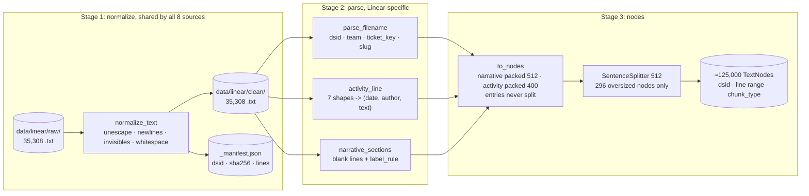

# Linear Ingestion: System Design

| | |
|---|---|
| **Status** | Draft, under review |
| **Owner** | Deepak Dantagani |
| **Scope** | The Linear source of EnterpriseRAG-Bench, from raw export to LlamaIndex nodes: normalize, parse, chunk. Embedding model choice, vector store and retrieval are out of scope; their numbers appear only where they constrain chunking. |
| **Source corpus** | EnterpriseRAG-Bench v1.0.0, Linear subset: 35,308 `.txt` exports (engineering, product and design tickets), 182 MB, ~45.6M tokens |
| **Related** | [Stories](../stories/6-linear.md) · [Story rules](../stories.md) · [Parser design](1-parser-system-design.md) · [Chunker design](2-chunker-system-design.md) |
| **Last updated** | 2026-09-23 |

---

## 1. Requirement

> Turn 35,308 Linear ticket exports into chunks that are the retrieval unit for
> EnterpriseRAG-Bench. Every chunk carries the `dsid` it came from, because `dsid` is
> what the benchmark scores. A ticket's narrative and its dated activity entries must
> stay separately retrievable, because they routinely disagree. Same input, same chunks,
> same ids, every run, with no network or model call in the pipeline.

Why this shape, in one paragraph. A Linear ticket is not a document with sections like a
Confluence page. It is a flattened record: a title, a narrative body, and an append-only
log of dated activity entries, concatenated into one text file with most field labels
stripped. The narrative says what was proposed; the log says what was decided three
months later. Embedding them as one vector blends a proposal with its own reversal, and
4 of the benchmark's Linear questions are explicitly about such contradictions. So the
chunk boundary that matters here is **narrative vs activity entry**, not heading depth.

Out of scope: the live Linear GraphQL API, webhooks, incremental sync, ACLs and
permission-aware retrieval. The input is a frozen export; none of those exist in it
(section 2 gives the field counts). Also out of scope: embedding model choice beyond its
token budget, vector store, reranking, answer generation.

## 2. The data

Measured on all 35,308 raw files, after unescaping the 805 JSON-escaped bodies.

**Files**

| | p10 | p50 | p95 | max |
|---|---|---|---|---|
| words per ticket | 432 | 674 | 1,024 | 2,225 |
| tokens per ticket (chars/4) | 876 | 1,254 | 1,916 | 4,281 |
| lines per ticket | 11 | 34 | 72 | 280 |
| title length (chars) | 42 | 76 | 102 | 150 |

Teams by filename prefix: ENG 23,168 · PM 8,703 · DES 3,436. Line 1 is the title and
line 2 is blank in 35,307 of 35,308 files. One file has no `TEAM-number` in its name
(`dsid_7955b78f…__suggestions-risk-badge-visual-exploration.txt`); 5,060 `TEAM-number`
keys appear under more than one `dsid`, so the ticket key is **not** a unique id.

**Structure is flat.** Markdown is almost absent: 394 files have a `#` heading, 20 have a
code fence, 2 have a table. 12,057 have bullets and 10,365 have bare label lines
(`Background`, `Goal`, `Open questions`) — the same pattern the Confluence label rule
already handles.

**Activity entries are the real structure.** 33,260 files (94.2%) contain at least one
dated activity line; 208,691 such lines in total, 16.6% of all non-blank lines. They
arrive in seven shapes:

| shape | example | lines |
|---|---|---:|
| `date - author:` | `2025-02-10 10:22 - Aisha Patel: Kickoff note…` | 103,823 |
| `date author:` | `2026-03-10 Ava Martinez: Created ticket after…` | 52,559 |
| `date:` (no author) | `2025-02-14: Chose hybrid scoring: exact-match…` | 39,724 |
| `date \| author:` | `2025-02-08 \| Ava Martinez: Created ticket after…` | 5,179 |
| `date (author):` | `2025-12-02 (Michael Nguyen): Drafted event names…` | 4,411 |
| `author (date):` | `Marta Ruiz (2026-03-12): Need final alt-text…` | 2,847 |
| `[date] author:` | `[2025-02-13] Liam Patel: Pulled initial wireframes into Figma…` | 148 |

Each entry is exactly one line: median 23 words, p95 37, max 119. Only 1.6% are under
10 words, and there are no bot posts, no "+1", no emoji-only lines. Every entry is
substantive.

**The log is not a clean tail.** Only 52.5% of files keep their activity lines as one
uninterrupted block at the end. In the other 47.5%, narrative resumes after the entries
(p90 = 11 more narrative lines) — the export flattened several ticket fields in
whatever order it had them, so a "test plan" list can follow the comment log. A
file-level "everything after the first date is the log" rule is therefore wrong for
roughly 16,000 files. **Every line must be judged on its own**, exactly as the Confluence
parser judges headings.

**Workflow metadata does not exist in the export.** Grepped all 35,308 files for the
fields a live-API design would index:

| field | files containing it |
|---|---:|
| `Owner:` | 144 (0.4%) |
| `State:` / `Status:` | 21 / 6 |
| `Estimate:` / `Priority:` / `Labels:` | 15 / 9 / 5 |
| `Team:` `Project:` `Created:` `Updated:` | 1 each |
| `Assignee:` `Cycle:` `URL:` | 0 |

So `state`, `priority`, `labels`, `project_id`, `acl_principals` and `is_archived` are
unfillable. The only metadata that exists is derivable: `dsid` and team prefix and ticket
key from the filename, and `(date, author)` parsed out of each activity line.

**What the benchmark asks.** 58 of the 500 questions touch Linear; 44 are Linear-only.

| type | questions | expected docs each |
|---|---:|---|
| basic | 24 | 1 |
| semantic | 10 | 1 |
| intra_document_reasoning | 9 | 1 |
| project_related | 9 | 2–9, **always spanning other sources** |
| conflicting_info | 4 | 2, always Linear vs Confluence or Linear vs Jira |
| constrained | 2 | 1–2 |

Two consequences. **44 of 58 are single-document** — Linear retrieval is mostly "find the
one right ticket", so chunk→`dsid` attribution and lexical matching decide the score.
And **no question is answered by grouping several Linear tickets**: `project_related`
always means "this ticket plus the Confluence ADR plus the GitHub PR", so cross-ticket
project grouping inside Linear is not built.

Lexical matching matters more than usual here. Across the 2,427 gold answer facts: 43%
contain a number, 34% a CAPS/Camel token (`HARD_BLOCK`, `TTFT`), 14% a snake_case
identifier (`max_file_size`, `optimize.quality_gate.run_started`), 6% a unit (`<5ms`,
`99.99%`). Dense vectors alone lose these; the index must be hybrid.

## 3. Functional requirements

| # | Requirement | Verified by |
|---|---|---|
| **F1** | Normalize any source's raw export to clean UTF-8 text: unescape JSON-escaped bodies (`\n`, `\"`, `\t`), CR/CRLF → LF, nbsp and zero-width → space or drop, strip trailing whitespace, collapse 3+ blank lines to 1, ensure a final newline. | unit tests + corpus golden |
| **F2** | Preserve every other byte. No lowercasing, no punctuation stripping, no stopword removal, no URL or identifier rewriting. | golden fingerprint |
| **F3** | Write the clean corpus to `data/linear/clean/` with a `_manifest.json`: one row per file with `dsid`, source, `raw_sha256`, `clean_sha256`, byte and line counts. | manifest test |
| **F4** | Parse the filename into `dsid`, `team`, `ticket_key`, `slug`; tolerate the one file with no ticket key by leaving `team` and `ticket_key` empty. | unit tests |
| **F5** | Take line 1 as the ticket title. | corpus count |
| **F6** | Classify every remaining non-blank line independently as an **activity entry** (one of the seven shapes) or **narrative**. Never make a file-level decision. | truth set (section 7) |
| **F7** | Parse each activity entry into `(date, author or None, text)`. `author` is None for the 39,724 author-less entries. | truth set |
| **F8** | Group consecutive narrative lines into sections at blank lines and bare label lines, reusing the existing `label_rule`. | unit tests |
| **F9** | Emit LlamaIndex `TextNode`s: narrative sections packed to ≤ 512 tokens, consecutive activity entries packed to ≤ 400 tokens, **never splitting a single entry across nodes**; anything still over 512 tokens goes through `SentenceSplitter`. | size test over all files |
| **F10** | Every node carries `dsid`, `source="linear"`, `team`, `ticket_key`, `title`, `chunk_type` (`narrative` \| `activity`), `start_line`, `end_line`, `clean_sha256`, and for activity nodes `date_start` / `date_end` / `authors`. | schema test |
| **F11** | Node id is `sha256(clean_sha256 + ":" + start_line + ":" + end_line)`, matching the Confluence scheme. | golden ids |
| **F12** | Index all 35,308 tickets. No team filter, no date window, no comment quality filter. | corpus count |
| **F13** | Emit the title as its own indexed field as well as inside the first node, so lexical search can weight it. | schema test |
| **F14** | Every non-blank line of every clean file lands in exactly one node. | coverage test |

Explicitly **not** built, with the reason: webhook/incremental sync (input is frozen),
ACL and permission filters (no ACL data, single tenant), workflow-field metadata (does
not exist, section 2), comment quality filtering (no noise to filter, section 2),
LLM-generated issue summaries (violates N1), cross-source deduplication (each source is
graded independently; deduping would delete gold documents).

## 4. Non-functional requirements

| # | Requirement | Target | Checked by |
|---|---|---|---|
| **N1** | **Deterministic.** Same input → same output. No network call, no model call, no clock, no randomness anywhere in the pipeline. | absolute | golden fingerprints |
| **N2** | **Behaviour-preserving.** A refactor changes no output byte. | absolute | `tests/golden/linear_*.json` |
| **N3** | **Source-agnostic normalization.** F1 is one module shared by all 8 sources, with no Linear-specific rule in it. | absolute | same module used by a second source's tests |
| **N4** | **Traceable.** Every node maps back to one `dsid` and an exact line range in a file of a known sha256. | 100% | coverage + schema tests |
| **N5** | **Lossless.** No node content is dropped, truncated or summarized. | 100% | coverage test (F14) |
| **N6** | **Size.** Every node ≤ 512 tokens on the embedder's tokenizer. | 100% | size test |
| **N7** | **Throughput.** Full 35,308-file corpus, one process, laptop, normalize→nodes. | < 180 s | timed test |
| **N8** | **Memory.** Streaming, one file at a time; never hold the corpus in memory. | < 500 MB RSS | timed test |
| **N9** | **Readable.** One idea per function, top-of-file story, input→output doctests, early returns. One function per PR, ~60 lines including tests. | review | review |
| **N10** | **Hybrid-ready.** Node text and metadata are sufficient for BM25 as well as dense retrieval; identifiers, numbers and URLs survive normalization intact. | absolute | F2 golden |
| **N11** | **No duplicated rule.** A rule that is true for more than one source lives in one shared module, not once per source. Measured basis: the existing `fix_structure` alters 0 of the 35,308 Linear files, so Confluence's cleaner is reused rather than reimplemented. | absolute | review + shared tests run over fixtures from 3 sources |
| **N12** | **Source boundary is explicit.** `pipeline/` splits into shared modules, `pipeline/confluence/` and `pipeline/linear/`. A shared module imports nothing from a source package; a source package owns only what is true for that source. | absolute | import test: no shared module imports `pipeline.confluence` or `pipeline.linear` |
| **N13** | **Observable.** Every stage emits typed events through one LlamaIndex dispatcher, and a handler aggregates them into a per-stage `_stats.json` next to the manifest. A run that produces the wrong corpus is visible as a changed count, not only as 35,308 changed files. | absolute | stats golden |
| **N14** | **Observability never changes output.** Event `timestamp` and `id_` are non-deterministic and must never reach `_stats.json`, a manifest, a node id or any golden. Handlers aggregate counts only. | absolute | run twice, diff `_stats.json` byte for byte |

## 5. Back-of-envelope

Three candidate chunk policies, simulated over all 35,308 files at 4 chars per token:

| policy | chunks | per ticket p50 | tokens p10 / p50 / p95 | over 512 |
|---|---:|---:|---|---:|
| A — one chunk per ticket | 35,308 | 1 | 876 / 1,254 / 1,916 | 35,243 |
| B — narrative 512 + one chunk per activity entry | 296,613 | 8 | 31 / 49 / 504 | 296 |
| C — narrative 512 + activity packed to 400 | **124,879** | 3 | 130 / 383 / 509 | 296 |

**C is chosen.** A exceeds every embedder budget and blends proposal with reversal. B is
atomic but produces 208,691 vectors of median 49 tokens; a 30-token vector is dominated
by generic project vocabulary and drags precision down, and it multiplies the sibling
chunks that must later be collapsed back to one `dsid`. C keeps entries whole, groups
only consecutive ones, and lands a median node at 383 tokens. The 296 nodes still over
512 are single oversized narrative lines and go through `SentenceSplitter`.

| quantity | estimate |
|---|---|
| nodes | ≈ 125,000 |
| tokens to embed | ≈ 48M (45.6M text + ~20 tokens of title/breadcrumb per node) |
| one full embed | ≈ $6.20 (OpenAI 3-large) · $2.90 (Voyage 3.5) · $0.96 (OpenAI 3-small), list prices, verify before committing |
| vector storage | 1.5 GB at 3,072 dims float32 · 0.5 GB at 1,024 dims |
| corpus share | Linear is 182 MB of the benchmark's 1.41 GB — third by volume, after Slack (~560 MB zipped) and Gmail (~375 MB) |

Re-chunking and re-embedding the whole Linear corpus costs single-digit dollars and a
few minutes, so chunk-size choices stay cheap to revisit.

## 6. The pipeline



Ours: normalization, filename parsing, activity-line classification, section grouping,
packing, ids. Library: `SentenceSplitter` for the oversized tail, and LlamaIndex's
`TextNode` as the output type. The chunker is not custom — the packing rule is 30 lines
and everything downstream is library code.

## 7. Low-level design

Adding a second source is what forces the package boundary, so the split happens first
(LINEAR-1a) and Linear is built inside it. What is shared is decided by measurement, not
by taste: `fix_structure` changes 0 of the 35,308 Linear files, so Confluence's cleaning
rules are reused, not reimplemented (N11).

```
pipeline/normalize.py            F1, F2   shared: unescape + whitespace, all 8 sources
pipeline/label_rule.py           F8       shared: bare-label headings (10,365 Linear files use them)
pipeline/manifest.py             F3       shared: manifest_row, sha256          [exists, unchanged]
pipeline/corpus.py               F3       shared: save_text, save_manifest, write_clean_corpus
                                          [exists; gains one `clean=` parameter]
pipeline/observability.py        N13      shared: dispatcher, events, StatsCollector
pipeline/confluence/cleaning.py           Confluence-only: wiki headings, wiki tables, table separators
pipeline/confluence/…                     structure, to_markdown, buckets, headings, blocks  [moved, unchanged]
pipeline/linear/filename.py      F4
pipeline/linear/activity.py      F6, F7   the heart of this design
pipeline/linear/sections.py      F8
pipeline/linear/nodes.py         F9-F14
```

What is **not** written, because it already exists and works: `save_text`,
`save_manifest`, `manifest_row`, `sha256`, and `write_clean_corpus` — which needs one new
parameter (`clean=`) to serve a second source. The Confluence golden fingerprint hashes
only `file` and `clean_sha256`, so extra manifest keys do not break it.

### 7.1 `normalize.py` — one function, every source

Extracted from today's `pipeline/cleaning.py`, keeping its `CleanResult` return type so
that `manifest_row` (which takes a `CleanResult`) is reused unchanged. Confluence's
`clean_text` becomes this plus `fix_structure`; its goldens must not move.

```python
def normalize_text(raw: str) -> CleanResult:
    """Raw export bytes -> clean text + whether the body was JSON-escaped.

    No source-specific rule lives here: no wiki markup, no table repair.

    >>> normalize_text('Title\\r\\n\\nSummary:\\\\nDone.   \\n\\n\\n\\nEnd')
    CleanResult(text='Title\\n\\nSummary:\\nDone.\\n\\nEnd\\n', was_escaped=False)
    """
```

Order matters and is fixed: unescape (only when the body carries literal `\n`), then
CR/CRLF → LF, then invisibles, then trailing whitespace, then blank-line collapse, then
final newline. Unescaping first is what turns a 13-line Linear file into 58 lines and a
7-line Gmail file into 120 — every later rule depends on real line breaks existing.

### 7.2 `filename.py` — the id comes from the name, not the text

```python
class TicketName(NamedTuple):
    dsid: str        # 'dsid_000091d8da3a4642a3c5acd442676e48'
    team: str        # 'ENG' | 'PM' | 'DES' | ''
    ticket_key: str  # 'ENG-3927' | ''
    slug: str        # 'add-audit-log-events-for-gate-decisions-and-overrides'

def parse_filename(name: str) -> TicketName:
    """dsid_<32hex>__<TEAM>-<n>-<slug>.txt -> its four parts.

    >>> parse_filename('dsid_00009…__ENG-3927-add-audit-log.txt').ticket_key
    'ENG-3927'
    >>> parse_filename('dsid_7955b…__suggestions-risk-badge.txt').ticket_key
    ''
    """
```

`dsid` is the benchmark's scoring key and the only unique one: 5,060 `ticket_key`s are
shared by more than one file, so `ticket_key` is a friendly lookup field, never a
primary key.

### 7.3 `activity.py` — judge every line on its own

```python
class Entry(NamedTuple):
    date: str            # ISO 'YYYY-MM-DD'
    author: str | None   # None for the 39,724 author-less entries
    text: str

def activity_entry(line: str) -> Entry | None:
    """One line -> its activity entry, or None if the line is narrative.

    >>> activity_entry('2025-02-10 10:22 - Aisha Patel: Kickoff note.')
    Entry(date='2025-02-10', author='Aisha Patel', text='Kickoff note.')
    >>> activity_entry('2025-02-14: Chose hybrid scoring: exact-match first.')
    Entry(date='2025-02-14', author=None, text='Chose hybrid scoring: exact-match first.')
    >>> activity_entry('Marta Ruiz (2026-03-12): Need final alt-text strings.')
    Entry(date='2026-03-12', author='Marta Ruiz', text='Need final alt-text strings.')
    >>> activity_entry('- Emit first-class Audit Log events for the lifecycle.') is None
    True
    """
```

The two traps this function must not fall into, both measured:

- **`date:` entries contain colons.** `2025-02-14: Chose hybrid scoring: exact-match
  (priority), then lexical…` — splitting on the first colon after the date is correct;
  splitting on the last, or on any colon, destroys 39,724 entries.
- **Author-first entries exist.** 2,847 lines read `Marta Ruiz (2026-03-12): …`. A
  date-anchored-at-start rule silently misses them, and they cluster in DES files.

Author-less entries are kept, not discarded: 11,088 of them are timeline records
(`2026-03-11 - Security review requested…`) that carry decisions.

### 7.4 `sections.py` — narrative grouping

```python
def narrative_sections(lines: list[str]) -> list[tuple[int, int]]:
    """Consecutive narrative lines -> (start_line, end_line) sections.

    Breaks at blank lines and at bare label lines ('Background', 'Goal',
    'Open questions') via the existing label_rule. Activity lines are not here.
    """
```

Reuses `pipeline/label_rule.py` unchanged — 10,365 Linear files carry exactly the bare
labels that rule was written for, which is the one piece of Confluence work that
transfers directly.

### 7.5 `nodes.py` — packing and metadata

```python
def to_nodes(clean_text: str, name: TicketName, clean_sha256: str) -> list[TextNode]:
    """One clean ticket -> its LlamaIndex nodes, in file order."""
```

Packing rule, in full:

1. Line 1 is the title; it is prepended to every node's embedded text and also stored as
   its own metadata field (F13).
2. Walk the remaining lines in order, tagging each `narrative` or `activity` (§7.3).
3. Pack consecutive **narrative** lines up to 512 tokens; break early at a section
   boundary from §7.4.
4. Pack consecutive **activity** entries up to 400 tokens; **never split one entry**. An
   entry that alone exceeds 400 tokens becomes its own node.
5. A run of one kind always ends the current node when the other kind starts — this is
   what keeps a proposal out of the same vector as its reversal.
6. Any node still over 512 tokens (296 of them) goes through `SentenceSplitter`.

Node metadata (F10):

```python
{
  "dsid": "dsid_000091d8da3a4642a3c5acd442676e48",
  "source": "linear", "team": "ENG", "ticket_key": "ENG-3927",
  "title": "Add audit log events for Optimize quality gate decisions and overrides",
  "chunk_type": "activity",            # or "narrative"
  "start_line": 71, "end_line": 76,
  "clean_sha256": "…",
  "date_start": "2025-12-02", "date_end": "2026-02-18",   # activity nodes only
  "authors": ["Michael Nguyen", "Marcus Lin", "Jordan Lee"],
}
```

`date_start`/`date_end`/`authors` exist only on activity nodes and are filters, not
embedded text. The vector sees the title plus the node's own lines and nothing else.

### 7.6 `observability.py` — counting what the run did

The pipeline reads 35,308 files and writes ~125,000 nodes. Without counts, a rule change
that halves the activity entries is invisible until someone diffs the corpus. So each
stage announces what it did, one handler adds the announcements up, and the totals are
written as `_stats.json` next to that stage's manifest.

This uses LlamaIndex's own instrumentation module, already a dependency
(`llama-index-core==0.14.24`, API verified against that version). No new dependency, no
service, nothing leaves the process.

```python
# pipeline/observability.py
import llama_index.core.instrumentation as instrument
from llama_index.core.instrumentation.events.base import BaseEvent
from llama_index.core.instrumentation.event_handlers.base import BaseEventHandler

class TicketCleaned(BaseEvent):      # one per file
    was_escaped: bool = False
class EntryClassified(BaseEvent):    # one per non-blank line
    shape: str = ""                  # 'date - author:' … or 'narrative'
class NodeBuilt(BaseEvent):          # one per node
    chunk_type: str = ""
    tokens: int = 0

class StatsCollector(BaseEventHandler):
    """Adds events up. Counts only — never a timestamp, never an id."""

dispatcher = instrument.get_dispatcher("pipeline")
```

Who emits: `corpus.write_clean_corpus` emits `TicketCleaned`, `linear.activity` emits
`EntryClassified`, `linear.nodes` emits `NodeBuilt`. The pure functions do not import the
dispatcher — emission happens at the caller, so purity and the existing "imports nothing
that touches files" tests survive.

Output, asserted by a golden test:

```json
{
  "files_read": 35308, "files_escaped": 592,
  "activity_entries": 208691,
  "entries_by_shape": {"date - author:": 103823, "date:": 39724, "author (date):": 2847},
  "nodes_built": 124879, "nodes_over_512_tokens": 296
}
```

**The one hard rule (N14).** `BaseEvent` carries a `timestamp` and an `id_`, and both
change on every run. Neither may reach `_stats.json`, a manifest, a node id or a golden;
the collector stores counts and nothing else. The test is blunt: run the pipeline twice,
and the two `_stats.json` files must be byte-identical.

**Deliberately not now: tracing.** Arize Phoenix and OpenTelemetry record step timings and
show them in a UI. That answers "which step is slow" and "what did retrieval return",
which are query-time questions, not corpus-build questions — and timings cannot be
asserted in a test. Ingestion is a 3-minute offline batch, so it gets counts. The seam is
`dispatcher`: attaching a Phoenix handler at the query stage later adds a line there and
changes nothing in this pipeline.

### 7.7 Retrieval contract (what this design owes the next stage)

Not built here, but fixed here so the retrieval story cannot drift:

- **Hybrid is required, not optional** — 43% of gold facts contain a number and 14% a
  snake_case identifier (section 2).
- **Collapse siblings by `dsid` before scoring.** A ticket contributes a median of 3
  nodes; the benchmark scores `dsid`, so sibling nodes must count once.
- **Expand to the parent ticket for generation.** A median ticket is 1,254 tokens, so
  the whole ticket fits comfortably in context once its node is retrieved.

## 8. SLOs

| SLO | Target | Budget | Checked by |
|---|---|---|---|
| Coverage: every non-blank clean line is in exactly one node | 100% | zero; one lost line fails the build | test over all 35,308 files |
| Activity classification agrees with the hand-labelled truth set | ≥ 99% | ~20 lines of 2,000 | truth-set test (§9) |
| Size: node ≤ 512 tokens | 100% | zero | test over all files |
| Determinism: same input → same nodes, same ids | 100% | zero | `tests/golden/linear_nodes_fingerprint.json` |
| Normalization is byte-stable across refactors | 100% | zero | `tests/golden/linear_corpus_fingerprint.json` |
| Throughput: full corpus, one process, laptop | < 180 s | soft, warning only | timed test |
| `_stats.json` is byte-identical across two runs | 100% | zero | run-twice test |
| No shared module imports a source package | 100% | zero | import test |
| Confluence goldens unchanged by the package split | 100% | zero | existing PARSE goldens |

## 9. How we prove it

Mirrors what PARSE-17 did for Confluence headings. Before `activity.py` is written, hand-label
an **activity truth set**: 20 real files chosen to cover all seven shapes plus the
author-less and author-first cases, every non-blank line marked `activity` or `narrative`
by hand (~2,000 lines). `activity_entry` is then written against it, TDD, and the
disagreements are listed and explained rather than silently tuned away.

Three golden fingerprints lock the stages: clean corpus, activity classification, and
node ids with line ranges. Any refactor that moves a byte fails a test.

## 10. Open questions

0. **The escape rule is unresolved and is the first story.** 805 Linear files contain a
   literal `\n`, but the existing `is_escaped` (literal count > real count, minimum 5)
   flags only 592. The 213-file gap holds three different things: bodies that are only
   *partly* escaped (`Summary:\nDesign pass…`, 30 literal vs 31 real), files whose
   escaping sits inside an embedded code sample (`Python paginator example:\nfrom redwood
   import Client\n…`), and ~68 files with one or two literal `\n` that are a genuine
   printf or regex. Unescaping the wrong group damages code samples; not unescaping the
   right group leaves ~174 files with their body on one line. LINEAR-1b inspects all 213
   by hand before any rule changes.

1. **Packing cap of 400 tokens for activity runs** is reasoned, not measured against
   retrieval quality. Validate with recall@20 on the 58 Linear questions once an
   embedder is chosen; B (atomic) stays a one-line change if the data disagrees.
2. **`chunk_type` as a retrieval filter** — worth testing whether `conflicting_info`
   questions improve when both a `narrative` and an `activity` node from the same ticket
   are forced into the context.
3. **Cross-source questions.** 14 of 58 Linear questions need Confluence, GitHub, Jira or
   Slack indexed too. Nothing in this design blocks that, but the benchmark score for
   Linear cannot be reached with Linear alone.
