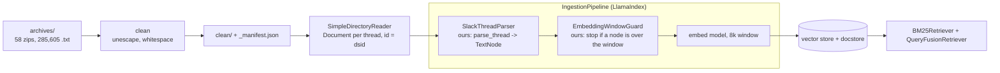

# Slack Ingestion: System Design

| | |
|---|---|
| **Status** | Draft, under review |
| **Owner** | Deepak Dantagani |
| **Scope** | The Slack source of EnterpriseRAG-Bench: clean, parse, chunk, embed. Retrieval appears only where it constrains the stages above. |
| **Inputs** | `data/slack/archives/`, 58 zip slices, 574 MB, from the [v1.0.0 release](https://github.com/onyx-dot-app/EnterpriseRAG-Bench/releases/tag/v1.0.0). 285,605 `.txt` files, one thread each. |
| **Related** | [Stories](../stories/7-slack.md) · [Story rules](../stories.md) · [Chunker design](2-chunker-system-design.md) |
| **Last updated** | 2026-09-23 |
| **Decision** | 2026-09-23: one file = one document. The thread is the retrieval unit; no message-level index. Sections 3 and 4 have the evidence. |
| **Decision** | 2026-09-23: `thread_ts` is a placeholder, not a date. No recency ranking on this corpus. Section 5. |
| **Decision** | 2026-09-23: hybrid retrieval, not dense-only. 72.8% of threads carry an exact-match token. Section 7. |

---

## 1. Requirement

> Turn 285,605 exported Slack threads into retrieval units for EnterpriseRAG-Bench:
> clean the export, parse each thread into messages and speakers, chunk it, embed it.
> Every chunk carries its channel, its participants and its doc id, so an answer can
> cite the conversation it came from. Same input, same chunks, same ids, every run.

### 1.1 Functional requirements

| # | Requirement | Verified by |
|---|---|---|
| FR-1 | Every one of the 285,605 threads is readable as text, with escape sequences resolved | SLACK-1 |
| FR-2 | Whitespace defects are repaired without destroying list or code indentation | SLACK-2 |
| FR-3 | Every stage reports what it did, per file and per stage, as structured events | SLACK-3 |
| FR-4 | The clean corpus is written once, with a manifest mapping raw bytes to clean bytes | SLACK-4 |
| FR-5 | Every thread resolves to a channel, or to `unknown` when the corpus does not carry one | SLACK-5 |
| FR-6 | Every thread splits into its messages, in both export layouts, without cutting a message | SLACK-6 |
| FR-7 | Every message yields its speaker, team or role, and whether the speaker is a bot | SLACK-7 |
| FR-8 | Every thread becomes one record: channel, participants, ordered messages, doc id | SLACK-8 (record), SLACK-8b (truth set) |
| FR-9 | A thread `Document` becomes a `TextNode` carrying channel and participants into the embedded text, via a custom `NodeParser` | SLACK-9 |
| FR-10 | One node per thread, never split; the run stops if a node is over the embedding model's window | SLACK-10 |
| FR-11 | An `IngestionPipeline` embeds and indexes the nodes for both dense and lexical retrieval | SLACK-11 |
| FR-12 | Retrieval quality is measured as recall@20 on the benchmark's Slack questions | SLACK-12 |

### 1.2 Non-functional requirements

| # | Requirement | Why |
|---|---|---|
| NFR-1 | **Deterministic.** Same input, same output, same ids. No network, no model call before the embedding stage | The Confluence pipeline's standing rule; it is what makes a golden fingerprint possible |
| NFR-2 | **Auditable.** Every clean file traces to its raw bytes by sha256, every chunk to its thread | An answer has to be defensible back to source |
| NFR-3 | **Restartable.** A run that dies part-way resumes without redoing finished work | 964 MB and ~285k embedding calls; a full restart is expensive |
| NFR-4 | **Behaviour-preserving.** `uv run python -m unittest discover tests` green, golden fingerprints unchanged | Same rule as PARSE-* |
| NFR-5 | **Readable.** One idea per function, story at the top of the file, doctests on input -> output | [stories.md](../stories.md) |
| NFR-6 | **Memory-bounded.** The corpus streams from the zips; never load 964 MB at once | Runs on one laptop |
| NFR-7 | **Library-first.** Anything LlamaIndex already does, we do not write. Section 8 is the audit | Stated goal of the project |
| NFR-8 | **Maintainable.** Rules live in named tables, not in branches. Every rule carries its measured corpus count as a test. A story that wants a new dependency must say which library component it rejected | A rule with no count is a rule nobody has justified; a count in a test is a rule that cannot rot silently |
| NFR-9 | **Observable.** Every stage emits structured events through LlamaIndex's `instrumentation` dispatcher; a handler writes them as JSON lines and a run summary. Instrumentation never changes output | A 285,605-file run that stalls or skips has to be diagnosable without rerunning it under a debugger |

The low-level design — one function per story, with its contract, its Gherkin and a
before/after from the corpus — is [7-slack.md](../stories/7-slack.md). This document holds
the requirements, the measurements and the decisions; that one holds the signatures.

Out of scope: access control, live sync, deletion propagation, PII redaction, deep links.
Section 9 records why, so each omission is a decision rather than an oversight.

## 2. The data

Measured over all 58 slices unless a row says otherwise.

| | |
|---|---|
| files | 285,605 |
| bytes | 964,465,933 (964 MB) |
| tokens at 4 chars | ~241M |
| largest file | 17,596 bytes |

**Per thread**, measured on slice 1 (5,000 files):

| | p50 | p90 | p99 | max |
|---|---|---|---|---|
| tokens | 821 | 1,256 | 1,725 | 3,101 |

Re-measured in SLACK-10 over all 285,597 nodes with LlamaIndex's default tokenizer, on the
embedded text: p50 831, p90 1,254, p99 1,714, **max 4,143** (slice 1 missed the largest).

Every thread fits in an 8k embedding window with room to spare. Unlike Confluence, where
every page had to be split, **nothing is split here**: one node per thread
([decision 0002](../decisions/0002-slack-one-node-per-thread.md)).

**Speakers per thread** (slice 1):

| speakers | 1 | 2 | 3 | 4-6 | 7-9 | 10+ |
|---|---|---|---|---|---|---|
| threads | 150 | 2 | 4 | 2,893 | 1,570 | 383 |

Median 6. **These are group channels, not DMs** — exactly two threads out of 5,000 have two
speakers.

**Content signals** (slice 1, share of threads):

| | share | consequence |
|---|---|---|
| contains an ID or codename (`r_9f8e7d6c`, `OF-ACME-001`, `Photon9B-int4`) | 72.8% | lexical, not semantic — BM25 is not optional |
| contains a URL | 56.2% | |
| contains a fenced code block | 72.8% | code survives into chunks; the cleaner must not touch it |
| contains a join/system message | 0.02% | Onyx already stripped them; no work for us |

## 3. What one file is

One file is one thread: a channel name, then messages in order.

```text
customer-success

Aisha (CS): Hey team - NovaCare sent an updated vendor risk assessment and DPA follow-up.
Can someone pick this up? Link: https://files.redwoodinternal/vra/novacare_2026.pdf :eyes:

Priya (Onboarding): I can take lead on the questionnaire. I'll start a column in the
onboarding tracker and ping the account team.

questionnaire-bot: Received nova-care_vra_2026.pdf. Extracted fields:
encryption_at_rest: unknown, soc2_type: unknown, dpa_signed: no, pci_scope: no
```

The filename carries the rest: `dsid_<hash>__<unix_ts>-<slug>.txt`. The dsid is unique
across all 285,605 files. **The timestamp is not a date** — section 5.

**This shape is Onyx's `thread_to_doc()` output, not Slack's wire format.** Their connector
groups a `thread_ts` and its replies into one `Document`, one `TextSection` per message, and
runs `SlackTextCleaner.index_clean()` over each message first — which is why `<@U123>`
mentions already read as `@username` and system messages are gone. What the flattening
dropped: per-message permalinks, per-message timestamps, reactions, user ids. Those are not
recoverable, and the expensive Slack-specific cleaning is already done for us.

**Threads do not overlap.** Zero duplicate dsids. 586 repeated slugs, all of them unrelated
conversations that happen to share a generic name — `remediation-owners-handoff` appears five
times, in different channels, about different incidents. Five randomly sampled threads each
open a fresh topic. One file is one complete context.

## 4. Channels

36 real channels cover 273,519 files (95.8%).

| channel | threads | | channel | threads |
|---|---:|---|---|---:|
| incidents | 24,044 | | people-ops | 7,340 |
| eng-platform | 23,184 | | architecture | 5,620 |
| eng-runtime | 21,765 | | finance | 5,117 |
| eng-ml | 17,132 | | random | 4,087 |
| support | 15,787 | | design | 3,685 |
| product | 15,744 | | new-hires | 3,364 |
| eng-releases | 15,288 | | eng-sre | 3,356 |
| customer-success | 13,804 | | all-hands | 3,337 |
| eng-infra | 12,404 | | eng | 1,611 |
| eng-security | 12,350 | | announcements | 1,529 |
| sales | 12,330 | | vendors | 1,057 |
| devex | 12,067 | | lunch-plans | 629 |
| marketing | 9,750 | | postmortems | 560 |
| docs | 9,238 | | general | 357 |
| eng-oncall | 8,506 | | help | 69 |
| partnerships | 8,345 | | release-war-room | 35 |

Engineering plus incidents is over half the corpus. Pure-noise channels (`random`,
`lunch-plans`, `memes`, `sports`) total about 4,700 threads, 1.6% — too few for filtering
them out to be worth a stage.

**11,827 files (4.1%) do not have a channel on line 1.** Sampled over 12 slices:

| line 1 is | count | channel recoverable? |
|---|---|---|
| `sources/slack/eng-ml/3312349999-....json` | 3,037 corpus-wide | yes, from the path |
| a bare timestamp, `1719998880` | ~2,000 | no |
| a message, `Elena: Quick sync - ...` | ~660 | no |
| a `dsid_` hash, a slug, or empty | ~6,100 | no |

So the channel rule is three steps: clean line 1, else the `slack/<channel>/` path, else
`unknown`. That recovers 3,037 documents for one regex and leaves 8,790 (3.1%) unknown.
*Re-measured by SLACK-5 on the whole corpus: 3,036 recovered from the path (with or without
`sources/`), 9,053 (3.2%) unknown.*

## 5. The timestamp is decorative

| | |
|---|---|
| distinct `thread_ts` values | 75,272 for 285,605 files |
| files sharing a timestamp with another file | 235,169 |
| most-reused value | `1765432100`, on 1,069 files |
| year range | 2001 to 2513 |
| in a plausible range (2024-2027) | 132,283 = 46.3% |
| year agrees with the most common year written in the thread | 22.6% of the 54,076 threads that contain an ISO date |
| a date in the text within 30 days of the timestamp (2024-2027 only) | 9.6%, against 4.6% for a shuffled pairing |

The values are keyboard walks — `1912345678`, `1923456789`, `2960001111`. They are
placeholders the generator wrote, not times anything happened.

*Re-measured by SLACK-8 over all 285,605 names. The first count read only the 279,405 names
with a slug (`__<ts>-<slug>`), hence 73,578 distinct and 1,063 on `1765432100`. The
timestamp carries a weak signal, a little above chance against dates in the text, but in about
nine threads out of ten it does not date the conversation. Messages have no timestamps of
their own: the 320 threads with lines like `[12:45 UTC] sophia:` are incident timelines and
agendas written inside a message. If time matters to a question, the dates written in the
text are the signal, and they are already in the embedded and BM25 text.*

So `thread_ts` is neither a date nor an identifier. **Use the dsid as the id, and keep the
timestamp out of chunk metadata.** Recency ranking is unavailable on this corpus; it is
dropped from the retrieval design rather than ranked on noise.

## 6. What cleaning has to do

Measured over all 285,605 files:

| defect | files | share |
|---|---|---|
| no final newline | 237,002 | 82.98% |
| trailing whitespace | 64,212 | 22.48% |
| indented speaker line (` tom_ae: ...`); re-measured by SLACK-2: 1,489 straightened | 27,225 | 9.53% |
| literal `\n` (8,334 of these are JSON-escaped bodies, SLACK-1) | 17,971 | 6.29% |
| literal `\"` | 17,232 | 6.03% |
| 3+ consecutive blank lines | 448 | 0.16% |
| carriage return | 250 | 0.09% |
| literal `\t` | 243 | 0.09% |
| non-breaking space | 47 | 0.02% |

The escaping defect is the same one the Confluence corpus had (910 files there, PARSE-1).

**The trap:** 27,057 files (9.47%) contain *legitimate* indentation — list items and fenced
code blocks. A blanket strip of leading whitespace would destroy them. The cleaner has to
tell an indented speaker line from an indented list item, which is why SLACK-2 is its own
story rather than one line inside another.

## 7. Pipeline



Nothing is written between the clean files and the index: `parse_thread` runs in memory
inside `SlackThreadParser` (the whole corpus parses in about 35 s), and the pipeline's
docstore and cache are the persisted state.

Ours: the cleaning rules, the parsing rules, turning a thread into one node, and the window
check. Library: the embedding, the indexing, the retrieval. Nothing is cut.

**Hybrid, not dense-only.** 72.8% of threads carry an exact-match token that dense retrieval
alone loses. **Channel is a free authority signal**: `postmortems` and `incidents` are
verified outcomes, `random` and `lunch-plans` are not.

## 8. What we reuse from LlamaIndex

Checked against the LlamaIndex docs on 2026-09-23, re-checked 2026-09-24 (NFR-7).

| Need | LlamaIndex component | Verdict |
|---|---|---|
| Read Slack | `SlackReader` (`llama-index-readers-slack`) | **Not usable.** It calls the Slack Web API for a live workspace. Our input is a static `.txt` export, so the reader has nothing to talk to. |
| Read the clean files | `SimpleDirectoryReader` | **Use it** (re-checked 2026-09-24). It reads the clean `.txt` files as they are, so we write no loader. `file_metadata` keeps only `file_name`: by default it adds `creation_date` and `last_modified_date`, which would reach the embedded text as invented dates. `filename_as_id` gives the full path, so the Document id is set to the dsid. |
| Run parsing + chunking + embedding as a pipeline | `IngestionPipeline` + `NodeParser` / `TransformComponent` | **Use it.** Our parser (SLACK-9) is a custom `NodeParser`, a thin wrapper whose insides are SLACK-5 to 8; the window check (SLACK-10) is a pass-through `TransformComponent`. Cleaning is not in it (SLACK-4): its output is files and a manifest, not nodes. |
| Split chat by speaker | node parsers: `SentenceSplitter`, `TokenTextSplitter`, `SemanticSplitter`, `Markdown`/`JSON`/`HTML`, `Hierarchical`; add-ons `chonkie`, `slide`, `docling` | **None fits**, re-checked 2026-09-24: they cut by size, meaning or markup, and none knows a speaker line. So the parser is ours, wrapped as a `NodeParser`. |
| Skip work already done on a re-run (NFR-3) | `IngestionCache`, `pipeline.persist()` / `.load()` | **Use it.** Each node+transformation pair is hashed and cached. This is most of what a hand-written resume would do. |
| Dedup and upsert by document id | docstore + `refresh_ref_docs()`, `upsert` | **Use it** for index-side identity, keyed on the dsid. Our `_manifest.json` stays, because it answers a different question — which raw bytes produced which clean bytes — and the docstore does not track that. |
| Split a thread | `SentenceSplitter`, `TokenTextSplitter`, `HierarchicalNodeParser` + `AutoMergingRetriever`, chunk references (`IndexNode` + `RecursiveRetriever`) | **Not needed**, measured 2026-09-26 on all 285,597 nodes: every thread fits an 8k window, so each is one node. `SentenceSplitter(2048)` would put 352 of its 759 cuts inside a message; chunk references cost 2× the embedding and stay a SLACK-12 variant. [Decision 0002](../decisions/0002-slack-one-node-per-thread.md). |
| Check a node fits the embedding window | none: embed models truncate silently (Ollama `num_ctx`, `HuggingFaceEmbedding` `max_length`) | **Ours**, SLACK-10: `EmbeddingWindowGuard`, a pass-through `TransformComponent` before the embed model. |
| Put channel and participants into the embedded text | `TextNode.metadata` + `text_template` + `metadata_template` + `excluded_embed_metadata_keys` | **Use it.** A node already renders `{metadata_str}\n\n{content}` with `{key}: {value}` per line, and can exclude a key from the embedded text while keeping it on the node. So SLACK-9's parser sets fields; it does **not** hand-build a header string. |
| Lexical retrieval | `BM25Retriever` | **Use it.** |
| Combine dense and lexical | `QueryFusionRetriever` (reciprocal rank fusion, relative score fusion) | **Use it.** |
| Rerank the top candidates | node postprocessors / rerankers | **Use it**, when SLACK-12 says reranking earns its cost. |
| Trace what a run did (NFR-9) | `instrumentation`: `Dispatcher`, `BaseEvent`, `BaseEventHandler`, `BaseSpan`, `@dispatcher.span` | **Use it.** Shipped in `llama-index-core` since 0.10.20; we pin 0.14.24, so it costs no new dependency. We define our events and one handler — we do not write a tracing framework. Our stages emit on the same dispatcher the library's do, so one run is one trace across both. |
| Export traces to a backend | `llama-index-observability-otel` | **Not now.** OpenTelemetry needs a collector running, which is a lot of apparatus for a local benchmark pipeline. The dispatcher above is the seam: if we ever want OTel, we attach their handler instead of writing anything. |

Net: we write the cleaning rules, the parsing rules, and two thin `NodeParser` wrappers
(SLACK-9, 10) that run them inside an `IngestionPipeline`. The reader and everything
downstream of a `TextNode` is library code.

## 9. Observability

Ingestion only for now. Query-time tracing gets designed when SLACK-12 exists and there is
something to trace.

Three artefacts, answering three different questions:

| artefact | question it answers | lifetime |
|---|---|---|
| `_manifest.json` | *what changed in this file, and from which raw bytes* | permanent, in git's eye, diffable |
| `data/slack/logs/<run_id>.jsonl` | *what happened during this run* — per-file events, failures, timings | per run |
| `profile.json` | *what is in the corpus* | regenerated when the corpus changes |

**The module is shared, not Slack's.** Gmail and Linear are being designed in parallel
worktrees and have the same need, so `pipeline/observability.py` lands on master on its own
before the source pipelines, and every event carries a `source` field. A fourth source adds a
value, not a module.

The mechanism is LlamaIndex's `instrumentation` module, not one of ours:

```python
import llama_index.core.instrumentation as instrument
dispatcher = instrument.get_dispatcher(__name__)

class FileCleaned(BaseEvent):
    source: str                        # "slack" | "gmail" | "linear"
    file: str
    rules_fired: list[str]

@dispatcher.span                       # one span per stage
def clean_corpus(...):
    ...
    dispatcher.event(FileCleaned(source="slack", file=name, rules_fired=fired))
```

Two rules keep it honest:

1. **Instrumentation never changes output.** The same corpus cleaned with the handler attached
   and detached produces identical `clean_sha256` values, and that is a test (NFR-1).
2. **A failure is an event, not a traceback.** A file that raises emits `FileFailed` with
   its name and the exception type, and the run continues. On 285,605 files, one bad file must
   not cost the other 285,604.

Pure functions (SLACK-1, SLACK-2, SLACK-5, SLACK-6, SLACK-7) do not touch the dispatcher. They
return what they did; the stage that calls them emits. That keeps them testable on strings and
keeps the tracing in one place.

## 10. Deferred, on purpose

Every production Slack-RAG write-up spends much of its length on concerns this benchmark
does not have. Recorded here so each is a decision:

| concern | why deferred |
|---|---|
| ACL, permission filtering, query-time identity | no users, no permissions, no identity in the benchmark |
| live sync, delta queries, edits and deletions | static export; nothing changes under us |
| DM governance | no DMs: 2 of 5,000 threads have two speakers |
| PII redaction, retention, legal hold | synthetic corpus |
| deep links to messages | permalinks were dropped by the exporter; unrecoverable |
| user-id resolution, system-message stripping | already done upstream; measured at 0.02% residue |
| recency ranking | the corpus has no usable clock (section 5) |
