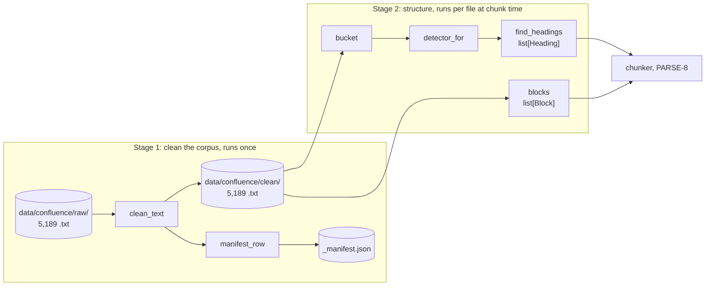

# Confluence Parser: System Design

| | |
|---|---|
| **Status** | Draft, under review |
| **Owner** | Deepak Dantagani |
| **Scope** | Parsing stage of the Enterprise RAG ingestion pipeline: PARSE-1 to PARSE-7 (clean, manifest, bucket, label rule, headings, blocks). The chunker (PARSE-8) and the LlamaIndex adapter (PARSE-9) are out of scope and will get their own design once this one is approved. |
| **Source corpus** | EnterpriseRAG-Bench, Confluence subset: 5,189 `.txt` exports (wikis, runbooks, structured documentation) |
| **Related** | [Stories](../stories.md) · [Decision 0001: parser choice](../decisions/0001-confluence-parser.md) |
| **Last updated** | 2026-09-14 |

---

## 1. Requirement

> Turn 5,189 Confluence page exports into clean text with a reliable section structure
> (headings) and block structure (lists, tables, code), so that the chunker can produce
> section-aware chunks and every line of every page is accounted for. The result must be
> deterministic and provable: the same input always gives the same output, and a
> one-number fingerprint proves nothing changed after a refactor.

What "reliable structure" means for this corpus: the pages were not written one way.
Only 32% use Markdown headings; 15% underline their headings; 53% write bare labels
such as `Overview:` with no markup at all. A standard Markdown parser sees no headings in
that last group. The parser must recover them.

Out of scope: chunk sizing, embeddings, retrieval, any network or model call.

## 2. Overview

The parser is a straight pipeline of pure functions with file handling at the edges.
Two stages, one folder in between:

- **Stage 1** reads each raw file once, fixes the export's damage (JSON-escaped bodies, wiki markup, missing table separators), writes the clean file, and records one manifest row per file as the audit trail.
- **Stage 2** never writes. Given clean text it answers two questions: where do sections start (`Heading` list) and which line ranges must stay whole (`Block` list). Both are plain values by line number, so the chunker needs no parser knowledge.

Golden checks lock every stage: a sha256 over the corpus-wide output of each function is stored under `tests/golden/`, so any change in behaviour fails a test.
